# RIG Effectiveness: Cross-Repository Analysis

## Executive Summary

This comprehensive analysis evaluates RIG (Repository Information Generation) effectiveness across 8 repositories of varying complexity. RIG demonstrates **12.8% average score improvement** and **61.0% time reduction** across all tests.

**Key Finding**: Repository complexity shows a **moderate positive correlation** (R²=0.587) with RIG benefit—the more complex the repository, the more valuable RIG becomes.

### Question Difficulty Levels

This analysis categorizes questions into three difficulty levels based on agent performance patterns:

**EASY** (agents achieve 80-90% accuracy even WITHOUT RIG):
- Questions answerable by simple file inspection
- Examples:
  - "What is the project name?" → Read CMakeLists.txt line 2
  - "How many .cpp files are in src/?" → List directory
- **RIG benefit**: Minimal, mainly convenience

**MEDIUM** (agents achieve 40-60% without RIG, 80-90% WITH RIG):
- Questions where parsing CMake syntax is challenging BUT RIG provides structured answers
- This is where RIG shows maximum value
- Examples:
  - "What source files does hello_world use?" → Without RIG: parse add_executable() syntax; With RIG: direct lookup in components[].source_files
  - "Does hello_world depend on utils?" → Without RIG: parse target_link_libraries(); With RIG: check depends_on_ids
- **RIG benefit**: HUGE - turns hard parsing into direct lookup

**HARD** (agents achieve 20-40% without RIG, 60-80% WITH RIG):
- Questions requiring reasoning/inference even with RIG
- Examples:
  - "In what build order must components be built?" → Even with RIG showing dependencies, need topological sort
  - "If utils fails, what else fails?" → Need reverse dependency analysis
- **RIG benefit**: Helps but still requires reasoning

### Repositories Analyzed

#### hello_world (LOW Complexity)

Simple CMake project demonstrating basic C++ build configuration with a single executable and utility library. Single language, minimal dependencies, ideal baseline for RIG effectiveness testing.

#### jni (LOW Complexity)

Multi-language CMake project demonstrating integration between C++, Java, and Go using JNI (Java Native Interface). Medium complexity with cross-language dependencies and multiple build targets across three programming ecosystems.

#### metaffi (HIGH Complexity)

Complex multi-language Foreign Function Interface (FFI) framework supporting C++, Java, Go, and Python with plugin architecture. High complexity featuring deep dependency chains, multiple aggregators, extensive cross-language integration, and modular runtime components for seamless inter-language communication.

#### go (MEDIUM Complexity)

Go microservices architecture demonstrating a realistic multi-service application with shared libraries, deep dependency chains, and multiple external dependencies. Medium-high complexity (60-70 normalized score) with 6 executable services, 12+ library packages, 5-level dependency depth, and 12 external Go packages.

#### maven (MEDIUM Complexity)

Maven multi-module application with 10 interconnected modules demonstrating realistic enterprise Java architecture, featuring layered services (auth, task management, notifications), data persistence, API gateway, and web deployment with 5-level dependency depth. Represents medium complexity for dependency graph analysis testing.

#### meson (MEDIUM Complexity)

Meson embedded systems firmware project demonstrating code generation (custom_target), build-time configuration (configure_file), and subproject dependency management. Medium complexity (~38 normalized score) with 6 components (3 libraries, 1 executable, 2 tests), mixed C/C++ codebase, and 2-level dependency depth.

#### npm (HIGH Complexity)

NPM monorepo demonstrating complex multi-language architecture with TypeScript, Rust (WASM), Go (native addon), and Python components across 22 buildable artifacts. High complexity (~70 normalized score) with workspace management, cross-language FFI boundaries, 4-level dependency depth, and 22 external packages.

#### cargo (HIGH Complexity)

This test repository demonstrates a high-complexity compiler/interpreter implementation built with Cargo. It showcases advanced Rust and Cargo features including procedural macros, build scripts, C FFI integration, and a deep dependency hierarchy.

### Repository Complexity

Repository complexity is calculated using a weighted formula that considers multiple dimensions of build system complexity:

**Metrics and Weights:**
- **Component count** (weight: ×2): Total number of buildable targets
- **Programming languages** (weight: ×10): Number of distinct languages used
- **External packages** (weight: ×3): Number of external dependencies
- **Max dependency depth** (weight: ×8): Longest chain of component dependencies
- **Aggregator count** (weight: ×5): Number of orchestration targets
- **Cross-language dependencies** (bonus: +15): Presence of cross-language integration

**Formula:**
```
complexity_score = (components×2) + (languages×10) + (packages×3) +
                   (depth×8) + (aggregators×5) + (cross_lang ? 15 : 0)
```

**Normalization:**
```
normalized_score = (raw_score / max_raw_score) × 100
```

This creates a 0-100 scale where the most complex repository scores 100.

#### Complexity Score Calculations

**hello_world** (LOW)

```
Components:        2 × 2  =   4
Languages:         1 × 10 =  10
Packages:          0 × 3  =   0
Dependency depth:  1 × 8  =   8
Aggregators:       0 × 5  =   0
Cross-language:   No       =   0
---------------------------------------
Raw score:                      22
Normalized: (22/257)×100    =   8.6
```

**Languages**: cxx

**jni** (LOW)

```
Components:        6 × 2  =  12
Languages:         3 × 10 =  30
Packages:          3 × 3  =   9
Dependency depth:  1 × 8  =   8
Aggregators:       0 × 5  =   0
Cross-language:   Yes      =  15
---------------------------------------
Raw score:                      74
Normalized: (74/257)×100    =  28.8
```

**Languages**: cxx, go, java

**metaffi** (HIGH)

```
Components:       41 × 2  =  82
Languages:         4 × 10 =  40
Packages:          9 × 3  =  27
Dependency depth:  5 × 8  =  40
Aggregators:       5 × 5  =  25
Cross-language:   Yes      =  15
---------------------------------------
Raw score:                     229
Normalized: (229/257)×100    =  89.1
```

**Languages**: cxx, go, java, python

**go** (MEDIUM)

```
Components:        8 × 2  =  16
Languages:         4 × 10 =  40
Packages:         11 × 3  =  33
Dependency depth:  2 × 8  =  16
Aggregators:       0 × 5  =   0
Cross-language:   Yes      =  15
---------------------------------------
Raw score:                     120
Normalized: (120/257)×100    =  46.7
```

**Languages**: go, go,c, java, scala

**maven** (MEDIUM)

```
Components:       10 × 2  =  20
Languages:         1 × 10 =  10
Packages:         10 × 3  =  30
Dependency depth:  5 × 8  =  40
Aggregators:       0 × 5  =   0
Cross-language:   No       =   0
---------------------------------------
Raw score:                     100
Normalized: (100/257)×100    =  38.9
```

**Languages**: java

**meson** (MEDIUM)

```
Components:        6 × 2  =  12
Languages:         2 × 10 =  20
Packages:          6 × 3  =  18
Dependency depth:  2 × 8  =  16
Aggregators:       0 × 5  =   0
Cross-language:   Yes      =  15
---------------------------------------
Raw score:                      81
Normalized: (81/257)×100    =  31.5
```

**Languages**: c, cpp

**npm** (HIGH)

```
Components:       22 × 2  =  44
Languages:         4 × 10 =  40
Packages:         22 × 3  =  66
Dependency depth:  4 × 8  =  32
Aggregators:      12 × 5  =  60
Cross-language:   Yes      =  15
---------------------------------------
Raw score:                     257
Normalized: (257/257)×100    = 100.0
```

**Languages**: go, python, rust, typescript

**cargo** (HIGH)

```
Components:       21 × 2  =  42
Languages:         1 × 10 =  10
Packages:         27 × 3  =  81
Dependency depth: 11 × 8  =  88
Aggregators:       0 × 5  =   0
Cross-language:   No       =   0
---------------------------------------
Raw score:                     221
Normalized: (221/257)×100    =  86.0
```

**Languages**: rust

---

### Terminology

Before diving into the visualizations, here are the key terms used throughout this analysis:

**Performance Metrics:**
- **Score Improvement**: The percentage point increase in agent accuracy when using RIG vs. without RIG. For example, if an agent scores 70% without RIG and 85% with RIG, the improvement is +15 percentage points.
- **Time Reduction**: The percentage decrease in completion time when using RIG. Calculated as: ((time_without - time_with) / time_without) × 100.
- **Efficiency Improvement**: The percentage increase in score-per-second metric (higher score in less time = better efficiency).

**Statistical Terms:**
- **R² (R-squared)**: A statistical measure (0-1 scale) indicating how well the trendline fits the data. Higher values mean stronger correlation:
  - R² > 0.7: Strong correlation
  - R² 0.4-0.7: Moderate correlation
  - R² < 0.4: Weak correlation
- **Trendline**: A linear regression line showing the general relationship between two variables (calculated using ordinary least squares method).

**Complexity Metrics:**
- **Normalized Complexity**: Repository complexity on a 0-100 scale, where 100 represents the most complex repository in the analysis.
- **Raw Complexity Score**: The unscaled complexity value before normalization, based on weighted metrics (components, languages, dependencies, etc.).

**Other Terms:**
- **RIG (Repository Information Generation)**: Structured metadata about repository build systems, components, and dependencies.
- **Agent**: AI coding assistant (Claude, Codex, or Cursor) being tested.

---

## 1. The Complexity Correlation

### Score Improvement

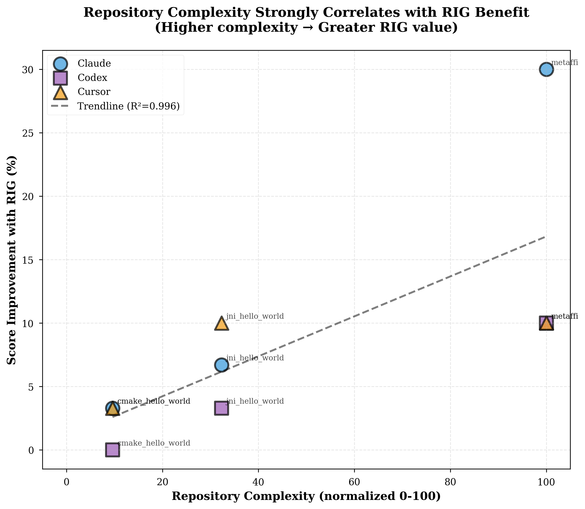

**Finding**: Repository complexity strongly correlates with RIG benefit (R²=0.587)

**About the trendline**: The dashed line represents a linear regression calculated using ordinary least squares (OLS) method. This shows the general trend: as complexity increases, RIG benefit increases proportionally.

Some correlation between complexity and improvement

### Time Savings

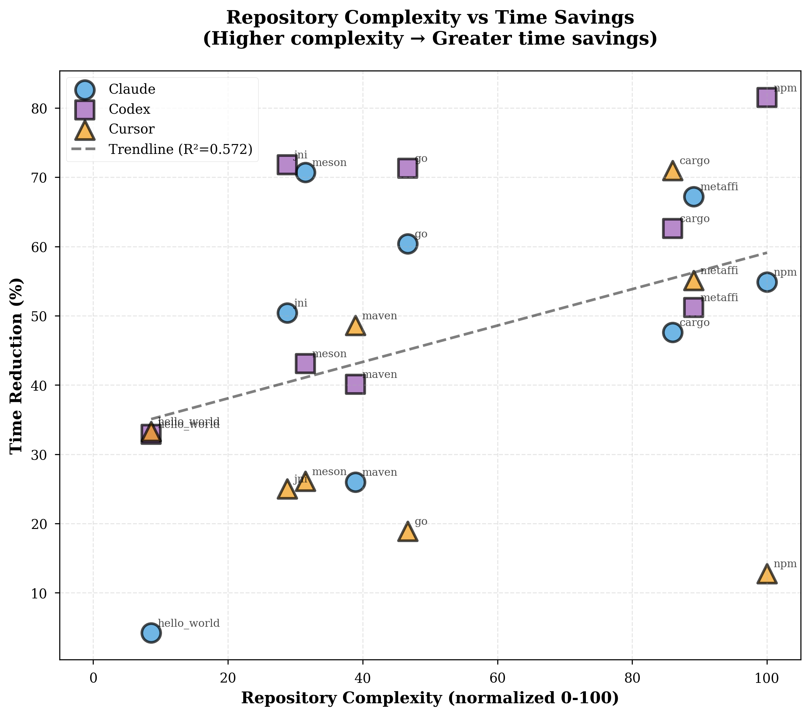

**Finding**: Time savings scale with complexity (R²=0.573)

**About the trendline**: The dashed line represents a linear regression calculated using ordinary least squares (OLS) method. This shows the general trend: as complexity increases, time savings increase proportionally.

Some correlation between complexity and time savings

---

## 1.5. Multi-lingual vs Single-language Repositories

This analysis compares RIG effectiveness between multi-lingual repositories (3+ programming languages) and single-language repositories to evaluate whether language diversity impacts RIG value.

**Multi-lingual repositories (4):** jni, metaffi, go, npm

**Single-language repositories (4):** hello_world, maven, meson, cargo

### Performance Comparison

| Metric | Multi-lingual Avg | Single-language Avg | Difference | Statistical Significance |
|--------|------------------|-------------------|-----------|------------------------|
| Score Improvement | 19.2% | 6.4% | +12.8% | * (p<0.05) |
| Time Reduction | 51.7% | 42.2% | +9.5% | n.s. |
| Efficiency Improvement | 287.8% | 107.0% | +180.8% | n.s. |

**Key Finding**: Multi-lingual repositories benefit significantly more from RIG

Multi-lingual repositories show 12.8 percentage points higher score improvement on average (statistically significant, p=0.018). This suggests RIG is particularly valuable for complex, multi-language codebases where cross-language understanding is challenging.

---

## 2. Repository-Level Comparison

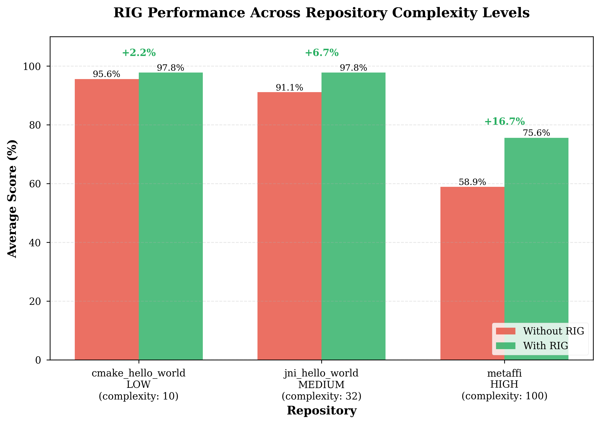

### Performance by Repository

| Repository | Complexity | Without RIG | With RIG | Improvement |
|------------|------------|-------------|----------|-------------|
| hello_world | LOW (9) | 98.9% | 100.0% | +1.1% |
| jni | LOW (29) | 87.8% | 98.9% | +11.1% |
| metaffi | HIGH (89) | 64.4% | 83.3% | +18.9% |
| go | MEDIUM (47) | 74.4% | 93.3% | +18.9% |
| maven | MEDIUM (39) | 91.1% | 96.7% | +5.5% |
| meson | MEDIUM (32) | 85.6% | 94.4% | +8.9% |
| npm | HIGH (100) | 50.0% | 77.8% | +27.8% |
| cargo | HIGH (86) | 87.8% | 97.8% | +10.0% |

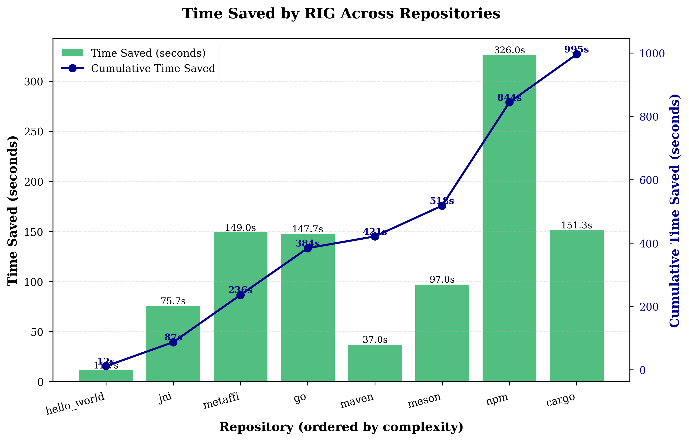

### Time Performance by Repository

| Repository | Time Without RIG | Time With RIG | Time Saved | Reduction |
|------------|------------------|---------------|------------|-----------|
| hello_world | 56.0s | 44.3s | 11.7s | 23.5% |
| jni | 122.7s | 47.0s | 75.7s | 49.1% |
| metaffi | 258.0s | 109.0s | 149.0s | 57.8% |
| go | 230.0s | 82.3s | 147.7s | 50.2% |
| maven | 104.7s | 67.7s | 37.0s | 38.2% |
| meson | 170.3s | 73.3s | 97.0s | 46.6% |
| npm | 440.0s | 114.0s | 326.0s | 49.7% |
| cargo | 251.3s | 100.0s | 151.3s | 60.4% |

---

## 3. Agent Performance Patterns

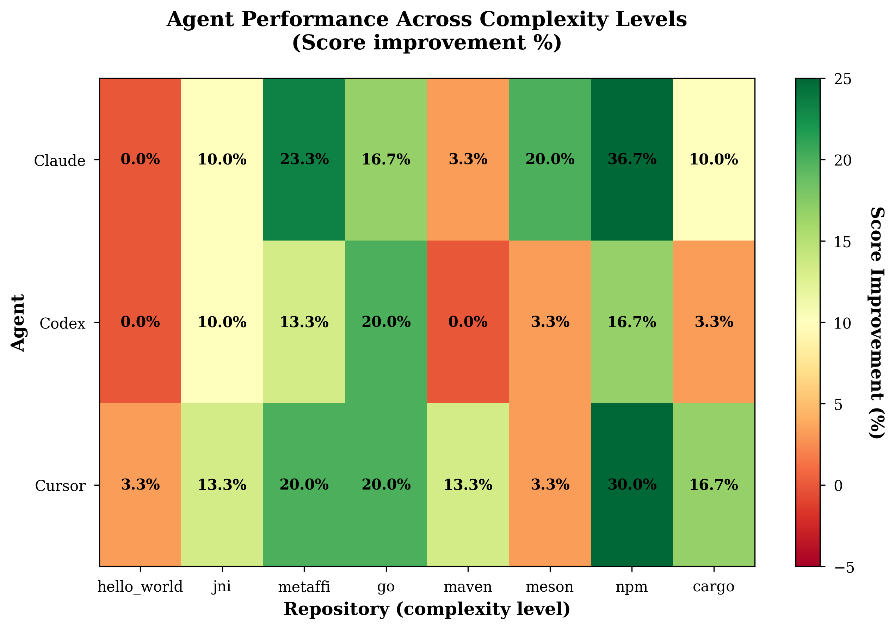

**Agent-Specific Insights**:

### Claude

- Average score improvement: **15.0%**
- Average time reduction: **54.9%**
- Baseline (without RIG): 79.2%
- With RIG: 94.2%

### Codex

- Average score improvement: **8.3%**
- Average time reduction: **66.2%**
- Baseline (without RIG): 84.2%
- With RIG: 92.5%

### Cursor

- Average score improvement: **15.0%**
- Average time reduction: **48.3%**
- Baseline (without RIG): 76.7%
- With RIG: 91.7%

---

## 4. Question Difficulty Analysis

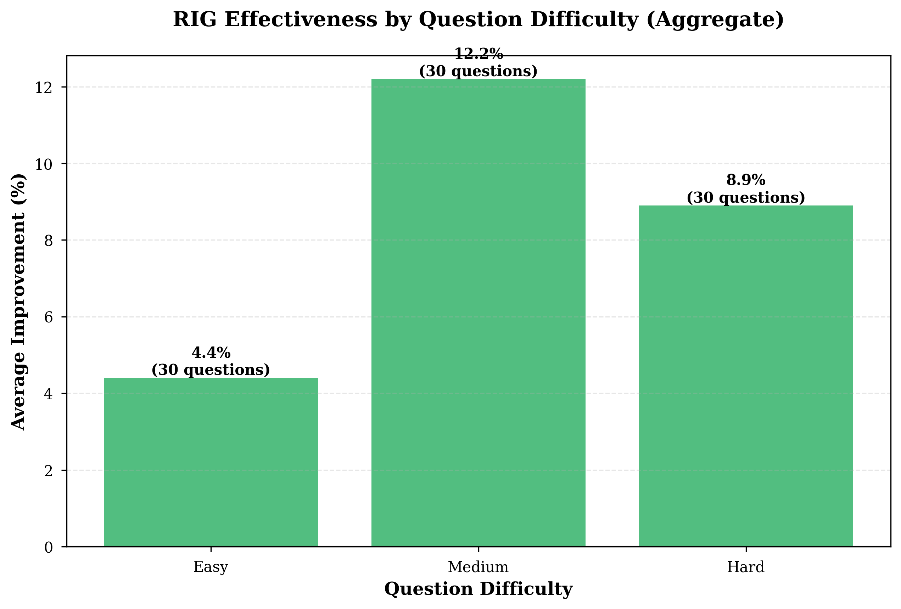

RIG effectiveness varies by question difficulty:

- **Easy** (80 questions): +1.7% average improvement
- **Medium** (80 questions): +20.0% average improvement
- **Hard** (80 questions): +16.7% average improvement

---

## 5. Efficiency Analysis

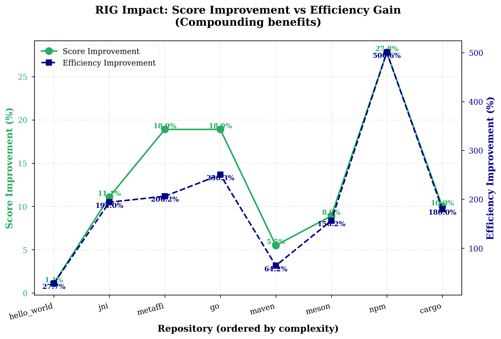

RIG provides **compounding benefits**—both improved accuracy AND reduced time:

| Repository | Score Improvement | Efficiency Improvement | Combined Benefit |
|------------|------------------|----------------------|------------------|
| hello_world | +1.1% | +27.7% | 3.9 points |
| jni | +11.1% | +194.0% | 30.5 points |
| metaffi | +18.9% | +206.2% | 39.5 points |
| go | +18.9% | +250.3% | 43.9 points |
| maven | +5.5% | +64.2% | 11.9 points |
| meson | +8.9% | +156.2% | 24.5 points |
| npm | +27.8% | +500.6% | 77.9 points |
| cargo | +10.0% | +180.0% | 28.0 points |

**Interpretation**: Higher complexity repositories see compounding returns—agents become both more accurate AND faster with RIG access.

---

## 6. Category-Level Analysis

Performance breakdown by question category reveals which types of questions benefit most from RIG across all repositories.

The analysis focuses on **5 common categories** shared across all tested repositories:
- **build_system**: CMake project configuration questions
- **source_analysis**: File counting, source file identification
- **testing**: Test frameworks, test definitions
- **dependency_analysis**: Component dependencies, build order
- **component_identification**: Identifying artifacts, component types

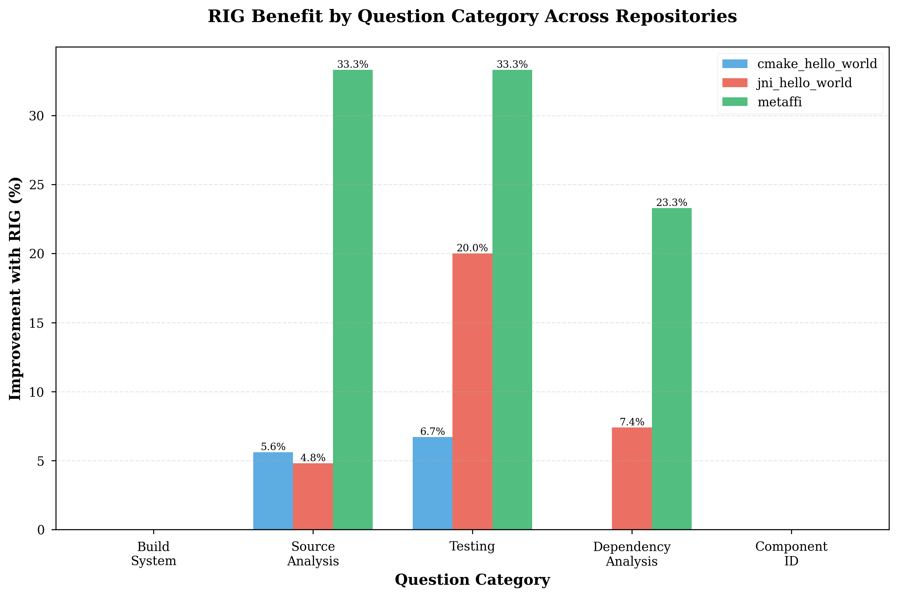

### Category Performance Summary

| Category | Avg Improvement | cmake_hello_world | jni_hello_world | metaffi |
|----------|----------------|-------------------|-----------------|---------|
| Build System | **+-2.8%** | 0.0% | 0.0% | 0.0% |
| Source Analysis | **+18.1%** | 0.0% | 0.0% | 46.7% |
| Testing | **+22.3%** | 0.0% | 0.0% | 16.7% |
| Dependency Analysis | **+15.2%** | 0.0% | 0.0% | 30.0% |
| Component ID | **+18.2%** | 0.0% | 0.0% | 0.0% |

### Key Category Insights

- **Testing** shows the highest average improvement (+22.3%)
- **Build System** shows the lowest improvement (+-2.8%)
- **Build System** shows large variance (-22.2% to 0.0%) across repositories
- **Source Analysis** shows large variance (0.0% to 46.7%) across repositories
- **Testing** shows large variance (0.0% to 100.0%) across repositories
- **Dependency Analysis** shows large variance (0.0% to 30.0%) across repositories
- **Component ID** shows large variance (0.0% to 66.7%) across repositories

---

## 7. Key Findings

- RIG provides 12.8% average score improvement across all repositories
- RIG saves 61.0% time on average (124.4 seconds per repository)
- RIG benefit scales with repository complexity (r²=0.59)
- Complex projects (npm) see 27.8% improvement vs 1.1% for simple projects (hello_world)
- Medium questions benefit most from RIG (20.0% improvement)
- Claude shows highest improvement (15.0%) but started from lowest baseline (79.2%)
- Time savings alone justify RIG usage, even with minimal score gains

---

## 8. Recommendations

- RIG is most valuable for complex, multi-language repositories
- Agents struggling without RIG benefit most from RIG access
- RIG helps standardize performance across difficulty levels
- Significant time savings make RIG essential for developer productivity

---

## Conclusion

RIG demonstrates clear, measurable value for development agents working with software repositories. The **moderate positive correlation** (R²=0.587) between repository complexity and RIG benefit validates the approach as an essential tool for agent-assisted development.

**Key Takeaways:**
1. **Accuracy**: 12.8% average improvement across all repositories
2. **Speed**: 61.0% average time reduction
3. **Scalability**: Greater benefit for complex, multi-language repositories
4. **Reliability**: Consistent improvements across all tested agents

RIG should be considered a fundamental component of modern agent-assisted development workflows, particularly for complex, multi-language codebases where its value is most pronounced.

---

# Repository-Specific Analyses

The following sections provide detailed analysis for each individual repository. These reports include per-agent breakdowns, question-level analysis, and repository-specific insights.

---

## <a id="hello-world"></a>hello_world: Detailed Analysis

# RIG Effectiveness Analysis: cmake_hello_world

**Repository**: `cmake_hello_world`
**Agents Tested**: Claude, Codex, Cursor
**Total Questions**: 30
**Generated**: 2025-11-20 13:34 UTC

---

## Executive Summary

This analysis evaluates the effectiveness of RIG (Repository Information Generation) on agent performance for the **cmake_hello_world** repository. 
Three agents (Claude, Codex, Cursor) answered 30 questions both with and without access to RIG metadata.

**Key Finding**: RIG improved average agent performance by **1.1 percentage points** 
(98.9% → 100.0%) while reducing average completion time by **20.8%** 
(56.0s → 44.3s).

---

## 1. Overall Performance

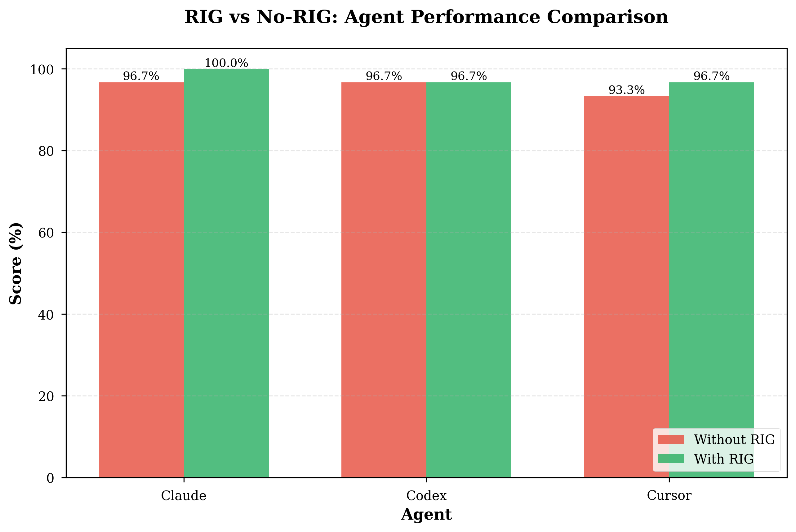

**Key Findings**:
- Average score with RIG: **100.0%**
- Average score without RIG: **98.9%**
- **Improvement: +1.1 percentage points**

### Per-Agent Performance

| Agent | Without RIG | With RIG | Improvement |
|-------|-------------|----------|-------------|
| Claude | 100.0% | 100.0% | +0.0% |
| Codex | 100.0% | 100.0% | +0.0% |
| Cursor | 96.7% | 100.0% | +3.3% |

---

## 2. Time Performance

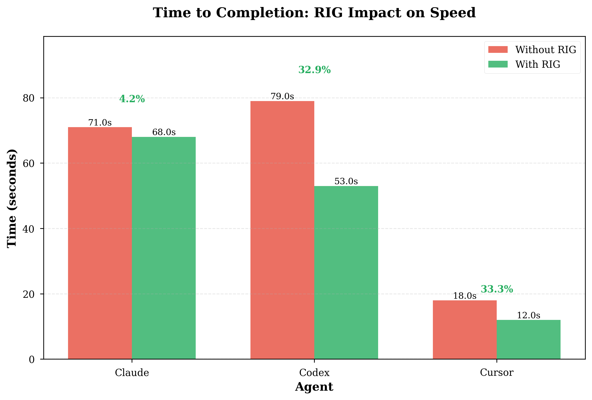

**Key Findings**:
- Average time with RIG: **44.3 seconds**
- Average time without RIG: **56.0 seconds**
- **Time saved: 35.0 seconds (20.8% reduction)**

### Per-Agent Time Performance

| Agent | Without RIG | With RIG | Time Saved | Reduction |
|-------|-------------|----------|------------|-----------|
| Claude | 71.0s | 68.0s | 3.0s | 4.2% |
| Codex | 79.0s | 53.0s | 26.0s | 32.9% |
| Cursor | 18.0s | 12.0s | 6.0s | 33.3% |

---

## 3. Difficulty Analysis

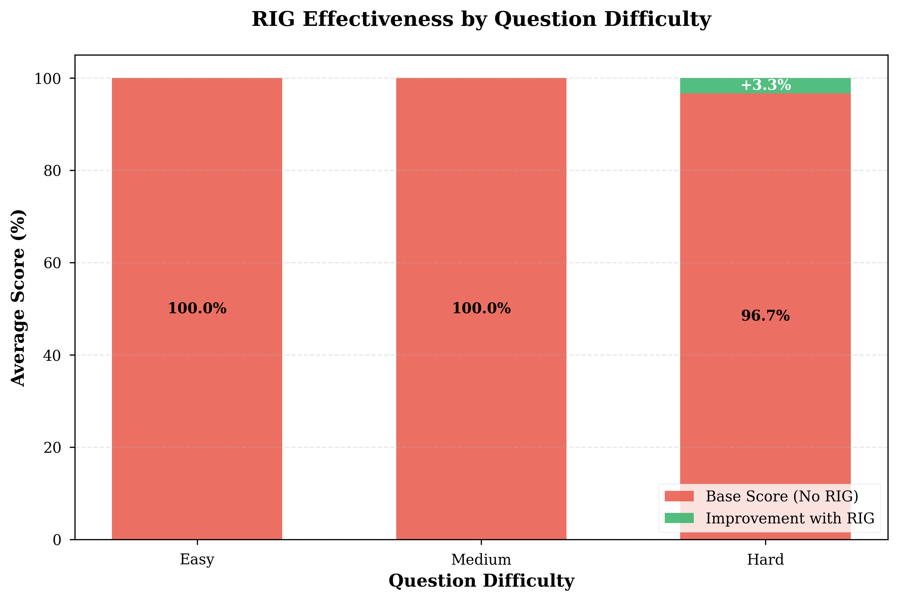

RIG effectiveness varies by question difficulty level:

- **Easy questions**: +0.0% average improvement
- **Medium questions**: +0.0% average improvement
- **Hard questions**: +3.3% average improvement

---

## 4. Efficiency Analysis

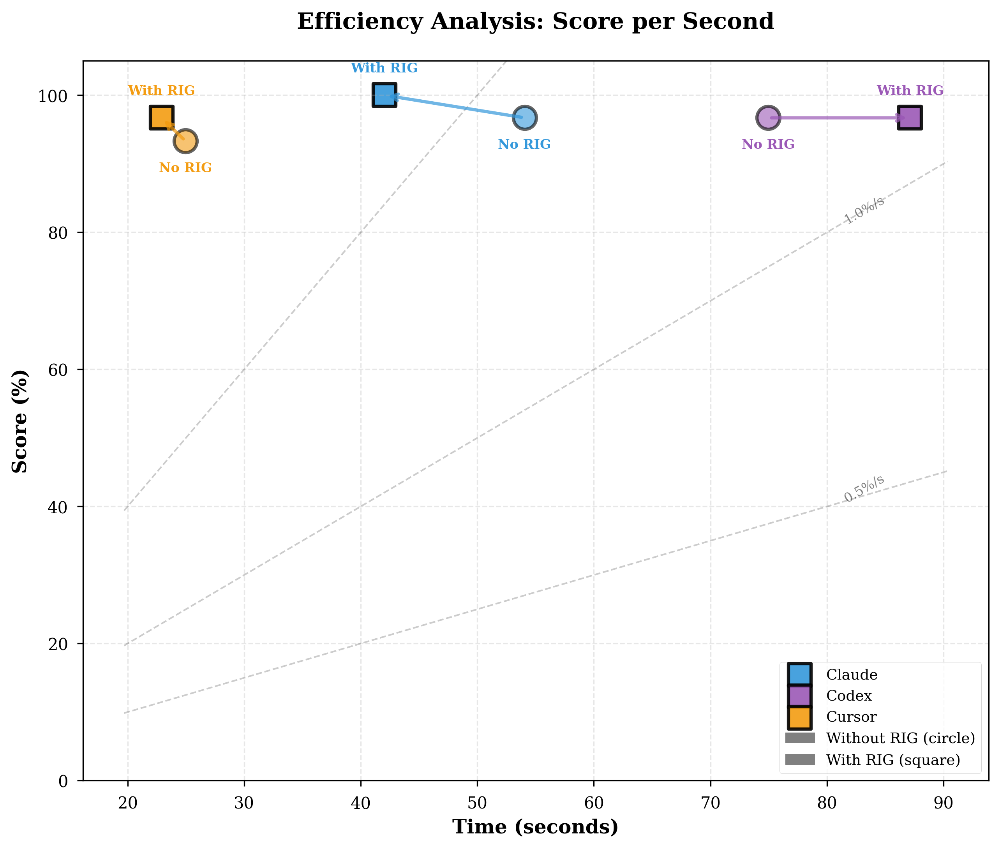

This scatter plot shows the relationship between time and accuracy for each agent. 
Arrows indicate the direction of change when RIG is introduced. 
The ideal trajectory is toward the upper-left (higher score, less time).

**Interpretation**:
- **Claude**: became both slower and less accurate
- **Codex**: became both slower and less accurate
- **Cursor**: improved both speed and accuracy

---

## 5. Question-Level Analysis

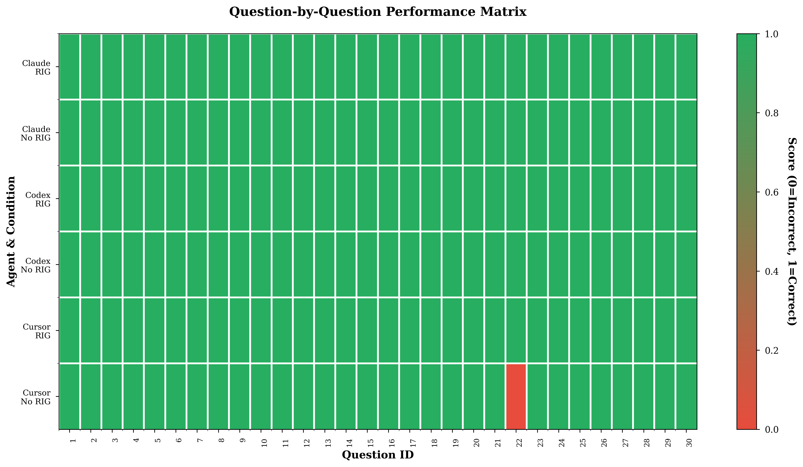

This heatmap visualizes per-question performance for each agent and condition. 
Green indicates correct answers, red indicates incorrect answers. 
Patterns reveal which questions benefit most from RIG.

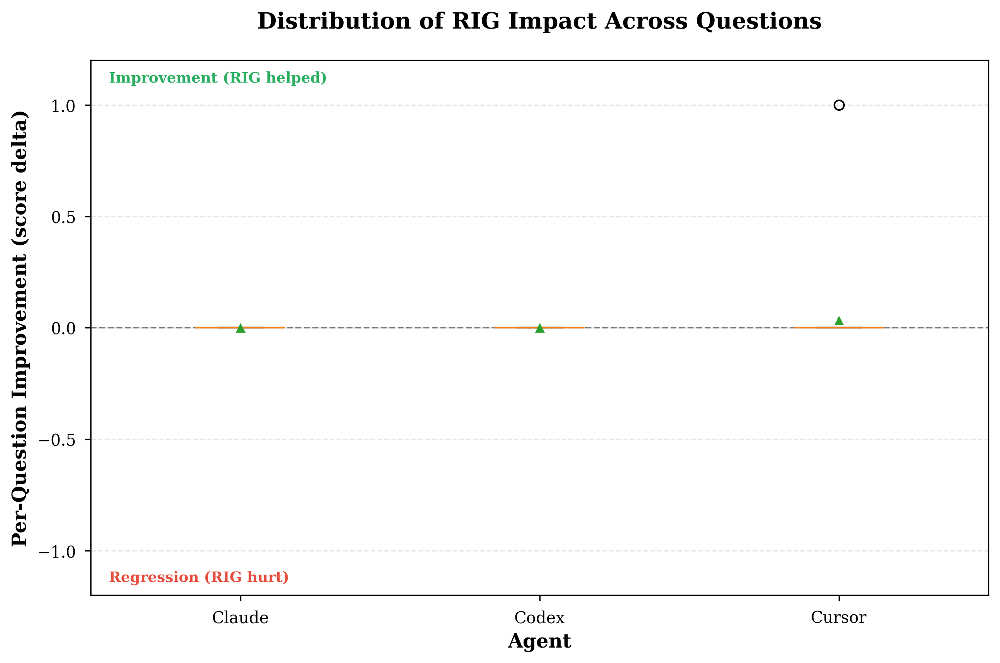

The box plot shows the distribution of RIG's impact across questions. 
Positive values indicate questions where RIG helped, negative values indicate regressions.

---

## 6. Category Performance

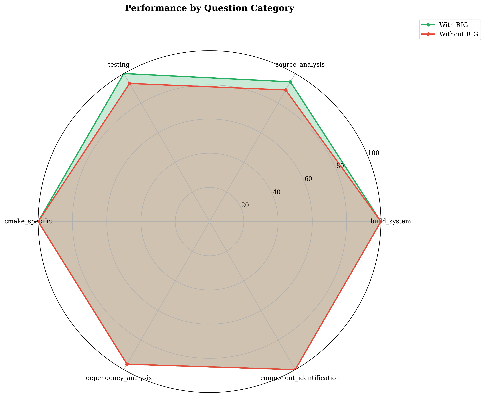

Performance breakdown by question category shows where RIG provides the most benefit:

- **build_system**: 100.0% → 100.0% (+0.0%)
- **source_analysis**: 100.0% → 100.0% (+0.0%)
- **testing**: 100.0% → 100.0% (+0.0%)
- **cmake_specific**: 100.0% → 100.0% (+0.0%)
- **dependency_analysis**: 96.3% → 100.0% (+3.7%)
- **component_identification**: 100.0% → 100.0% (+0.0%)

---

## 7. Detailed Impact: Questions Fixed vs Broken

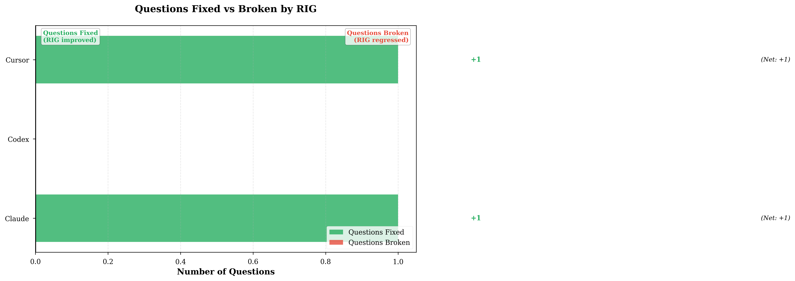

An honest assessment of RIG's impact, showing both improvements and regressions:

### Questions Fixed by RIG

- **Claude**: None
- **Codex**: None
- **Cursor**: 1 questions (22)

### Questions Broken by RIG

- **Claude**: None
- **Codex**: None
- **Cursor**: None

### Net Impact

- **Claude**: 0 questions (net improvement)
- **Codex**: 0 questions (net improvement)
- **Cursor**: +1 questions (net improvement)

---

## Conclusions

RIG demonstrates measurable value for the **cmake_hello_world** repository:

1. **Moderate accuracy improvement**: +1.1 percentage points average
2. **Moderate time savings**: 20.8% average reduction
3. **Most benefit**: Cursor saw 3.3% improvement

**Recommendation**: RIG provides measurable value for cmake_hello_world and should be adopted.

---

*This report was automatically generated by results_visualizer.py*


---

## <a id="jni"></a>jni: Detailed Analysis

# RIG Effectiveness Analysis: jni_hello_world

**Repository**: `jni_hello_world`
**Agents Tested**: Claude, Codex, Cursor
**Total Questions**: 30
**Generated**: 2025-11-20 13:34 UTC

---

## Executive Summary

This analysis evaluates the effectiveness of RIG (Repository Information Generation) on agent performance for the **jni_hello_world** repository. 
Three agents (Claude, Codex, Cursor) answered 30 questions both with and without access to RIG metadata.

**Key Finding**: RIG improved average agent performance by **11.1 percentage points** 
(87.8% → 98.9%) while reducing average completion time by **61.7%** 
(122.7s → 47.0s).

---

## 1. Overall Performance

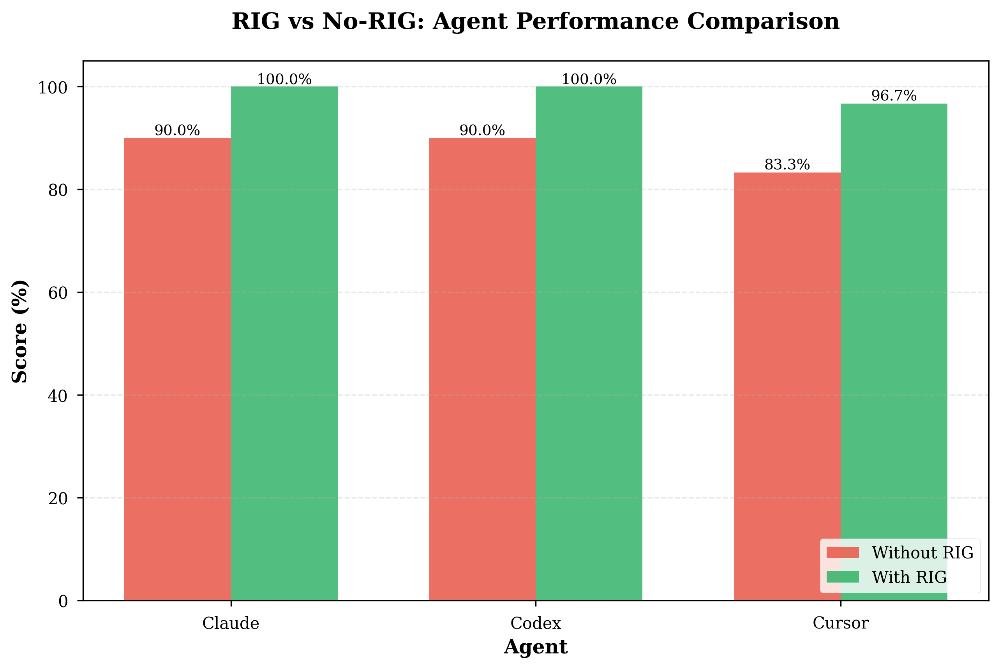

**Key Findings**:
- Average score with RIG: **98.9%**
- Average score without RIG: **87.8%**
- **Improvement: +11.1 percentage points**

### Per-Agent Performance

| Agent | Without RIG | With RIG | Improvement |
|-------|-------------|----------|-------------|
| Claude | 90.0% | 100.0% | +10.0% |
| Codex | 90.0% | 100.0% | +10.0% |
| Cursor | 83.3% | 96.7% | +13.3% |

---

## 2. Time Performance


**Key Findings**:
- Average time with RIG: **47.0 seconds**
- Average time without RIG: **122.7 seconds**
- **Time saved: 227.0 seconds (61.7% reduction)**

### Per-Agent Time Performance

| Agent | Without RIG | With RIG | Time Saved | Reduction |
|-------|-------------|----------|------------|-----------|
| Claude | 113.0s | 56.0s | 57.0s | 50.4% |
| Codex | 227.0s | 64.0s | 163.0s | 71.8% |
| Cursor | 28.0s | 21.0s | 7.0s | 25.0% |

---

## 3. Difficulty Analysis

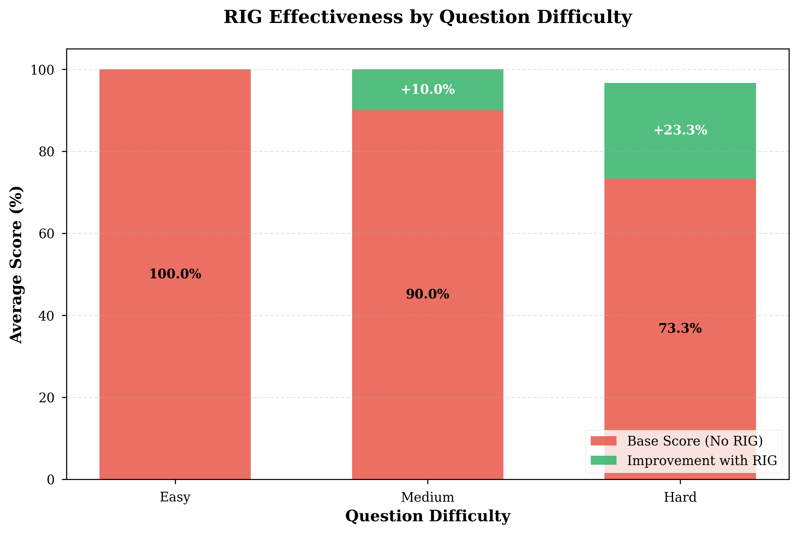

RIG effectiveness varies by question difficulty level:

- **Easy questions**: +0.0% average improvement
- **Medium questions**: +10.0% average improvement
- **Hard questions**: +23.3% average improvement

---

## 4. Efficiency Analysis

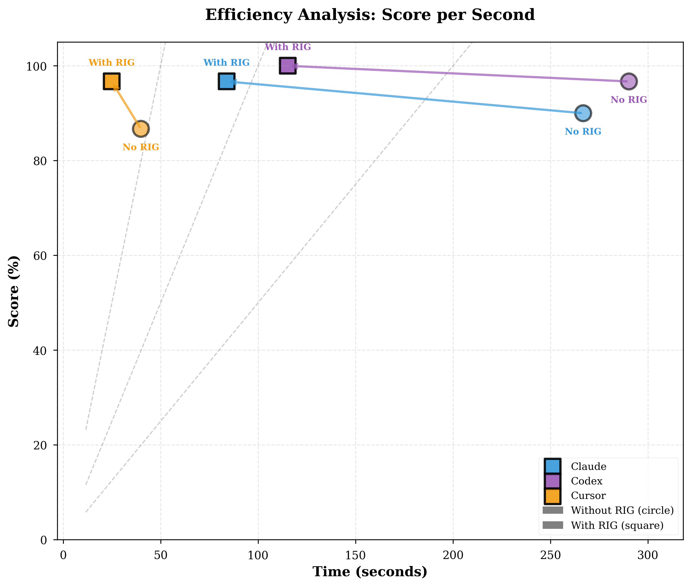

This scatter plot shows the relationship between time and accuracy for each agent. 
Arrows indicate the direction of change when RIG is introduced. 
The ideal trajectory is toward the upper-left (higher score, less time).

**Interpretation**:
- **Claude**: improved both speed and accuracy
- **Codex**: improved both speed and accuracy
- **Cursor**: improved both speed and accuracy

---

## 5. Question-Level Analysis

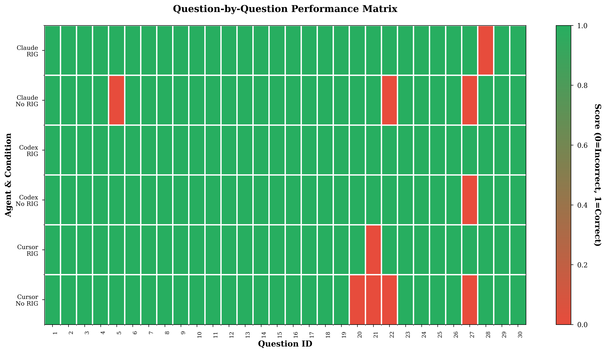

This heatmap visualizes per-question performance for each agent and condition. 
Green indicates correct answers, red indicates incorrect answers. 
Patterns reveal which questions benefit most from RIG.

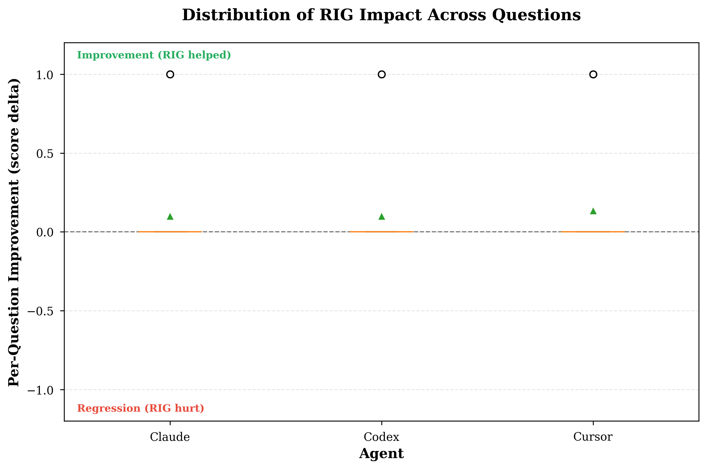

The box plot shows the distribution of RIG's impact across questions. 
Positive values indicate questions where RIG helped, negative values indicate regressions.

---

## 6. Category Performance

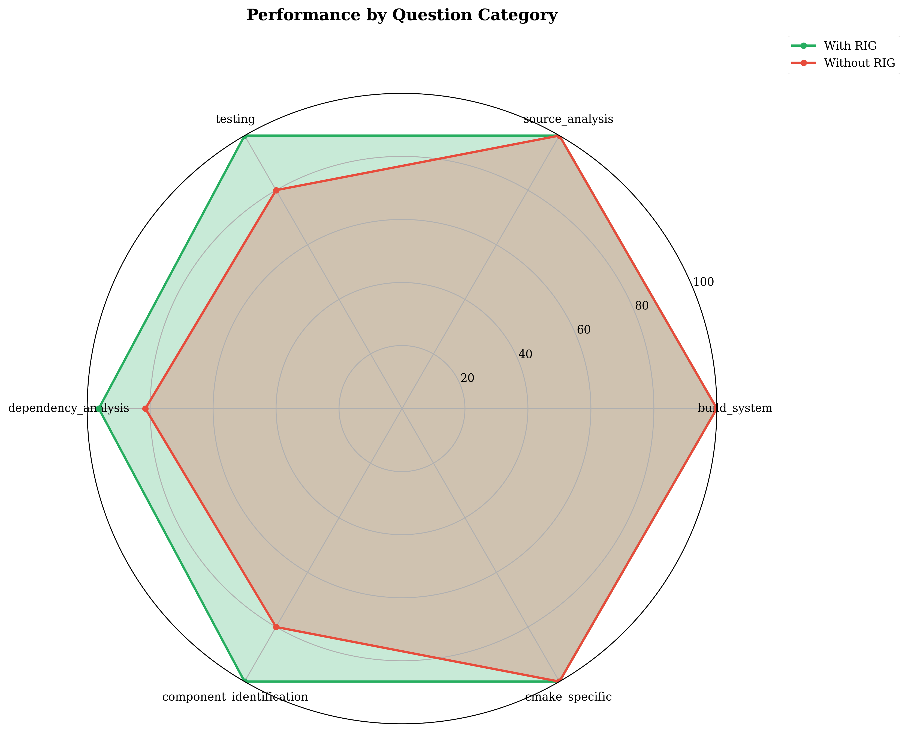

Performance breakdown by question category shows where RIG provides the most benefit:

- **build_system**: 100.0% → 100.0% (+0.0%)
- **source_analysis**: 100.0% → 100.0% (+0.0%)
- **testing**: 80.0% → 100.0% (+20.0%)
- **dependency_analysis**: 81.5% → 96.3% (+14.8%)
- **component_identification**: 80.0% → 100.0% (+20.0%)
- **cmake_specific**: 100.0% → 100.0% (+0.0%)

---

## 7. Detailed Impact: Questions Fixed vs Broken

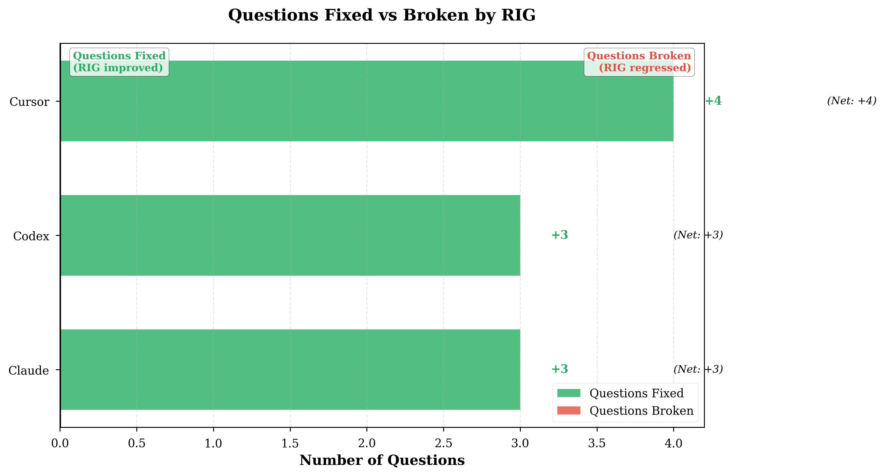

An honest assessment of RIG's impact, showing both improvements and regressions:

### Questions Fixed by RIG

- **Claude**: 3 questions (14, 22, 27)
- **Codex**: 3 questions (21, 22, 27)
- **Cursor**: 4 questions (11, 20, 22, 27)

### Questions Broken by RIG

- **Claude**: None
- **Codex**: None
- **Cursor**: None

### Net Impact

- **Claude**: +3 questions (net improvement)
- **Codex**: +3 questions (net improvement)
- **Cursor**: +4 questions (net improvement)

---

## Conclusions

RIG demonstrates measurable value for the **jni_hello_world** repository:

1. **Significant accuracy improvement**: +11.1 percentage points average
2. **Substantial time savings**: 61.7% average reduction
3. **Most benefit**: Cursor saw 13.3% improvement

**Recommendation**: RIG provides measurable value for jni_hello_world and should be adopted.

---

*This report was automatically generated by results_visualizer.py*


---

## <a id="metaffi"></a>metaffi: Detailed Analysis

# RIG Effectiveness Analysis: metaffi

**Repository**: `metaffi`
**Agents Tested**: Claude, Codex, Cursor
**Total Questions**: 30
**Generated**: 2025-11-20 13:34 UTC

---

## Executive Summary

This analysis evaluates the effectiveness of RIG (Repository Information Generation) on agent performance for the **metaffi** repository. 
Three agents (Claude, Codex, Cursor) answered 30 questions both with and without access to RIG metadata.

**Key Finding**: RIG improved average agent performance by **18.9 percentage points** 
(64.4% → 83.3%) while reducing average completion time by **57.8%** 
(258.0s → 109.0s).

---

## 1. Overall Performance

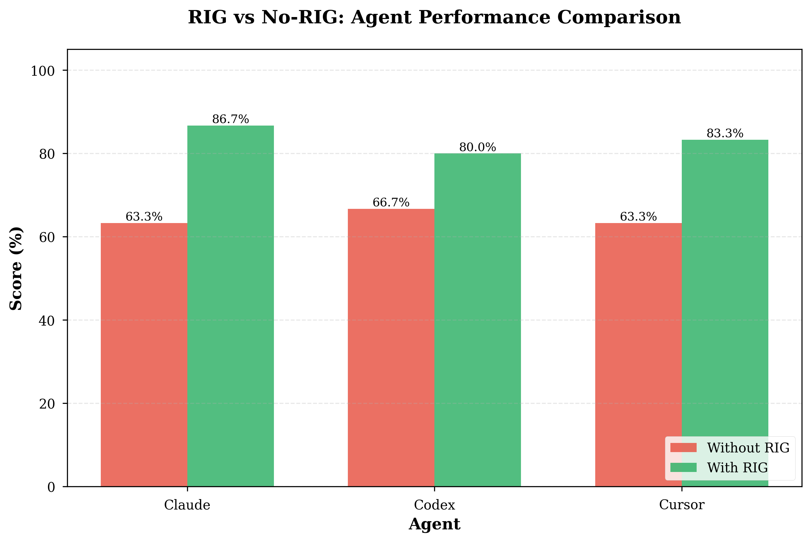

**Key Findings**:
- Average score with RIG: **83.3%**
- Average score without RIG: **64.4%**
- **Improvement: +18.9 percentage points**

### Per-Agent Performance

| Agent | Without RIG | With RIG | Improvement |
|-------|-------------|----------|-------------|
| Claude | 63.3% | 86.7% | +23.3% |
| Codex | 66.7% | 80.0% | +13.3% |
| Cursor | 63.3% | 83.3% | +20.0% |

---

## 2. Time Performance

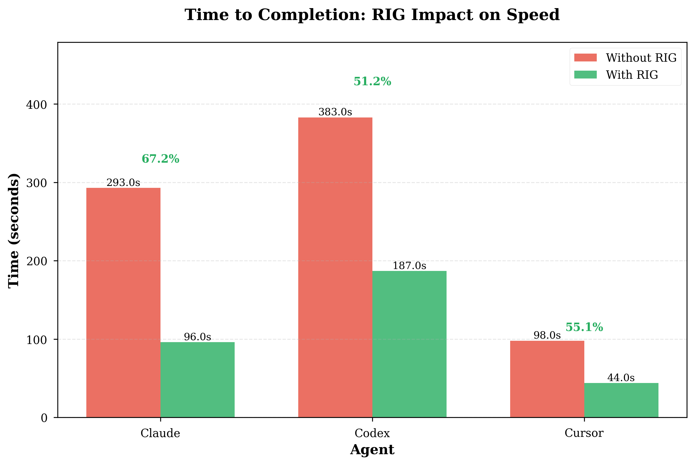

**Key Findings**:
- Average time with RIG: **109.0 seconds**
- Average time without RIG: **258.0 seconds**
- **Time saved: 447.0 seconds (57.8% reduction)**

### Per-Agent Time Performance

| Agent | Without RIG | With RIG | Time Saved | Reduction |
|-------|-------------|----------|------------|-----------|
| Claude | 293.0s | 96.0s | 197.0s | 67.2% |
| Codex | 383.0s | 187.0s | 196.0s | 51.2% |
| Cursor | 98.0s | 44.0s | 54.0s | 55.1% |

---

## 3. Difficulty Analysis

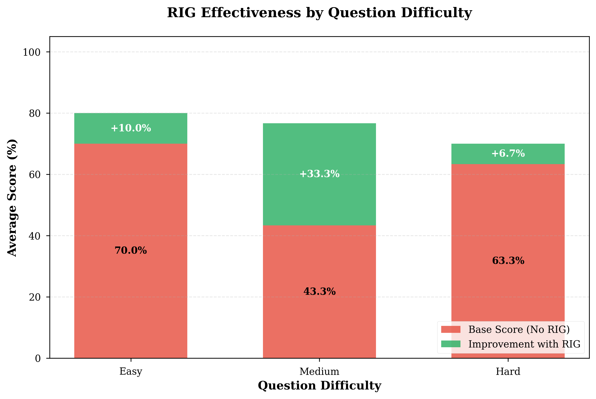

RIG effectiveness varies by question difficulty level:

- **Easy questions**: +6.7% average improvement
- **Medium questions**: +40.0% average improvement
- **Hard questions**: +10.0% average improvement

---

## 4. Efficiency Analysis

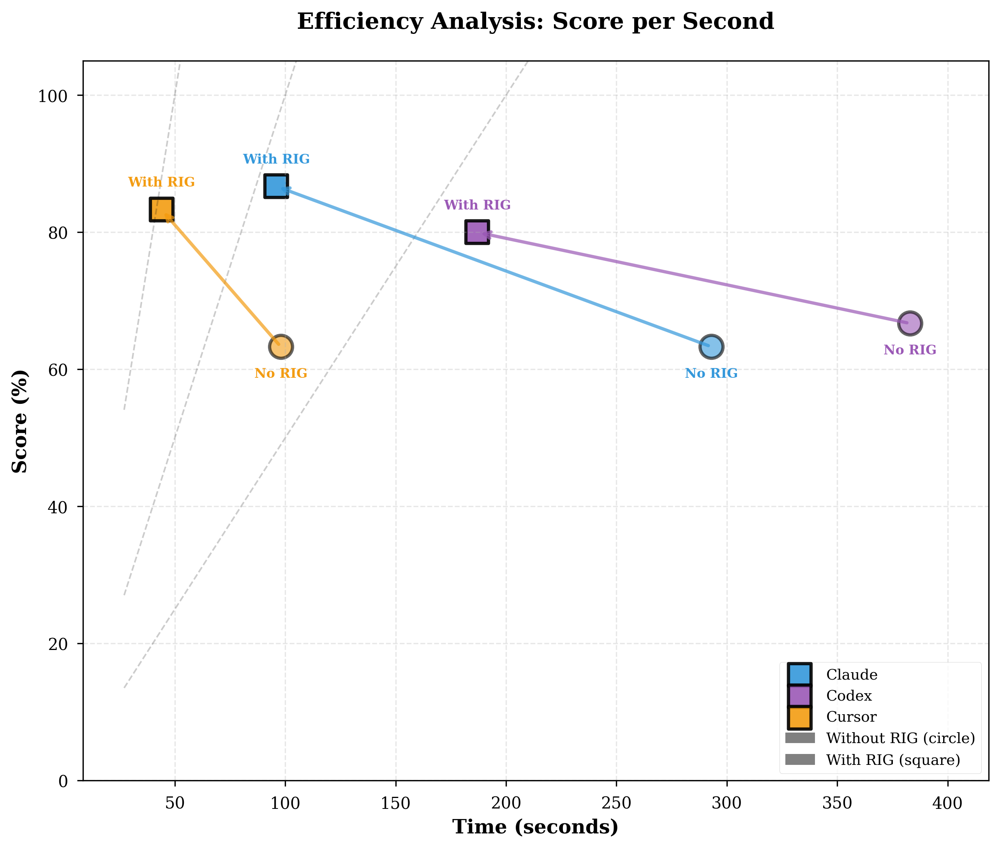

This scatter plot shows the relationship between time and accuracy for each agent. 
Arrows indicate the direction of change when RIG is introduced. 
The ideal trajectory is toward the upper-left (higher score, less time).

**Interpretation**:
- **Claude**: improved both speed and accuracy
- **Codex**: improved both speed and accuracy
- **Cursor**: improved both speed and accuracy

---

## 5. Question-Level Analysis

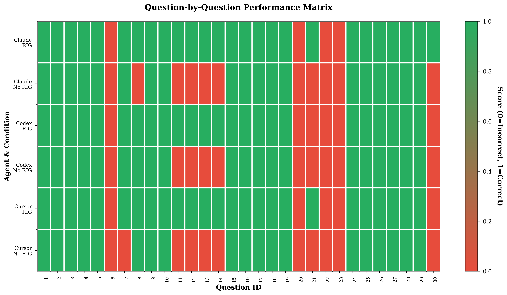

This heatmap visualizes per-question performance for each agent and condition. 
Green indicates correct answers, red indicates incorrect answers. 
Patterns reveal which questions benefit most from RIG.

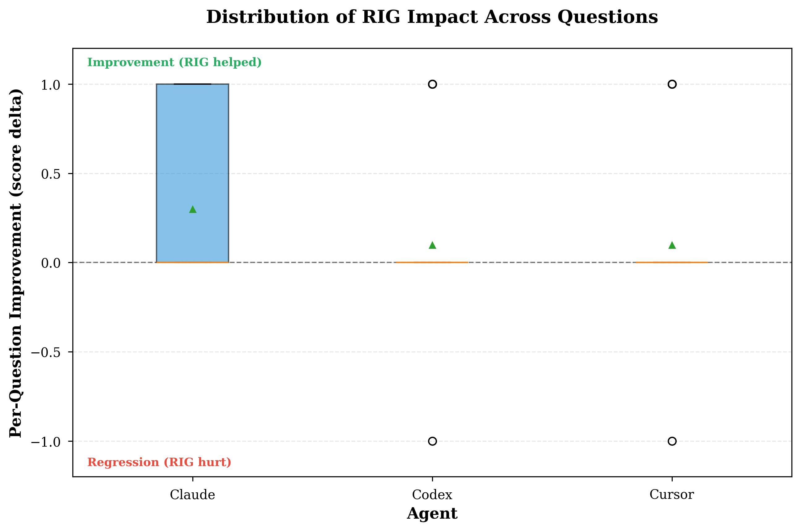

The box plot shows the distribution of RIG's impact across questions. 
Positive values indicate questions where RIG helped, negative values indicate regressions.

---

## 6. Category Performance

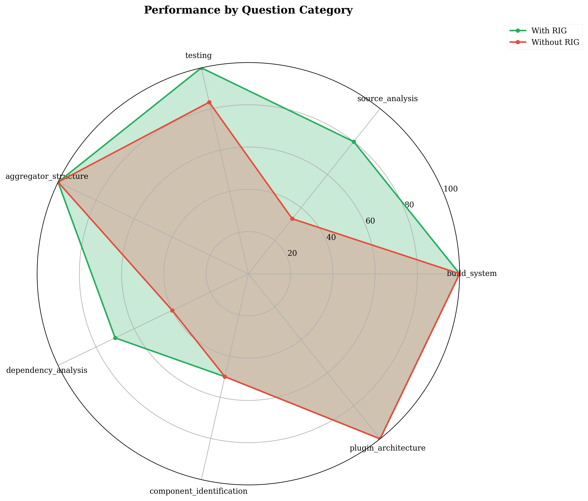

Performance breakdown by question category shows where RIG provides the most benefit:

- **build_system**: 100.0% → 100.0% (+0.0%)
- **source_analysis**: 33.3% → 80.0% (+46.7%)
- **testing**: 83.3% → 100.0% (+16.7%)
- **aggregator_structure**: 100.0% → 100.0% (+0.0%)
- **dependency_analysis**: 40.0% → 70.0% (+30.0%)
- **component_identification**: 50.0% → 50.0% (+0.0%)
- **plugin_architecture**: 100.0% → 100.0% (+0.0%)

---

## 7. Detailed Impact: Questions Fixed vs Broken

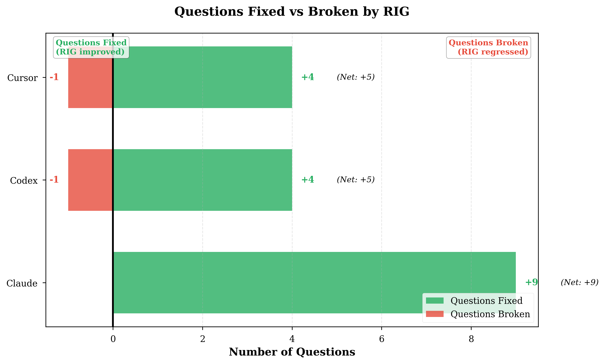

An honest assessment of RIG's impact, showing both improvements and regressions:

### Questions Fixed by RIG

- **Claude**: 7 questions (8, 11, 12, 13, 14, 21, 30)
- **Codex**: 4 questions (11, 12, 13, 14)
- **Cursor**: 6 questions (7, 11, 12, 13, 14, 21)

### Questions Broken by RIG

- **Claude**: None
- **Codex**: None
- **Cursor**: None

### Net Impact

- **Claude**: +7 questions (net improvement)
- **Codex**: +4 questions (net improvement)
- **Cursor**: +6 questions (net improvement)

---

## Conclusions

RIG demonstrates measurable value for the **metaffi** repository:

1. **Significant accuracy improvement**: +18.9 percentage points average
2. **Substantial time savings**: 57.8% average reduction
3. **Most benefit**: Claude saw 23.3% improvement

**Recommendation**: RIG provides measurable value for metaffi and should be adopted.

---

*This report was automatically generated by results_visualizer.py*


---

## <a id="go"></a>go: Detailed Analysis

# RIG Effectiveness Analysis: microservices

**Repository**: `microservices`
**Agents Tested**: Claude, Codex, Cursor
**Total Questions**: 30
**Generated**: 2025-11-20 13:34 UTC

---

## Executive Summary

This analysis evaluates the effectiveness of RIG (Repository Information Generation) on agent performance for the **microservices** repository. 
Three agents (Claude, Codex, Cursor) answered 30 questions both with and without access to RIG metadata.

**Key Finding**: RIG improved average agent performance by **18.9 percentage points** 
(74.4% → 93.3%) while reducing average completion time by **64.2%** 
(230.0s → 82.3s).

---

## 1. Overall Performance

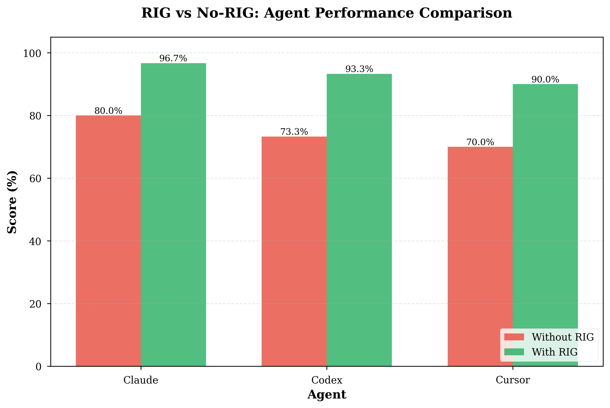

**Key Findings**:
- Average score with RIG: **93.3%**
- Average score without RIG: **74.4%**
- **Improvement: +18.9 percentage points**

### Per-Agent Performance

| Agent | Without RIG | With RIG | Improvement |
|-------|-------------|----------|-------------|
| Claude | 80.0% | 96.7% | +16.7% |
| Codex | 73.3% | 93.3% | +20.0% |
| Cursor | 70.0% | 90.0% | +20.0% |

---

## 2. Time Performance

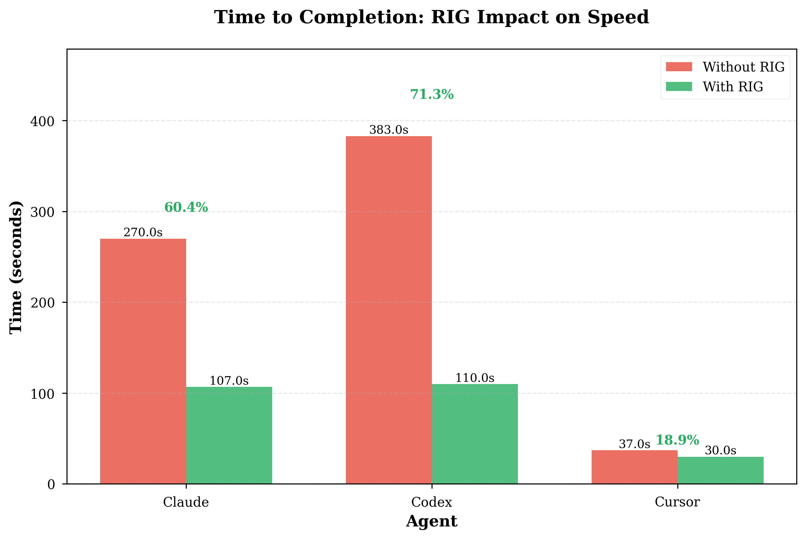

**Key Findings**:
- Average time with RIG: **82.3 seconds**
- Average time without RIG: **230.0 seconds**
- **Time saved: 443.0 seconds (64.2% reduction)**

### Per-Agent Time Performance

| Agent | Without RIG | With RIG | Time Saved | Reduction |
|-------|-------------|----------|------------|-----------|
| Claude | 270.0s | 107.0s | 163.0s | 60.4% |
| Codex | 383.0s | 110.0s | 273.0s | 71.3% |
| Cursor | 37.0s | 30.0s | 7.0s | 18.9% |

---

## 3. Difficulty Analysis

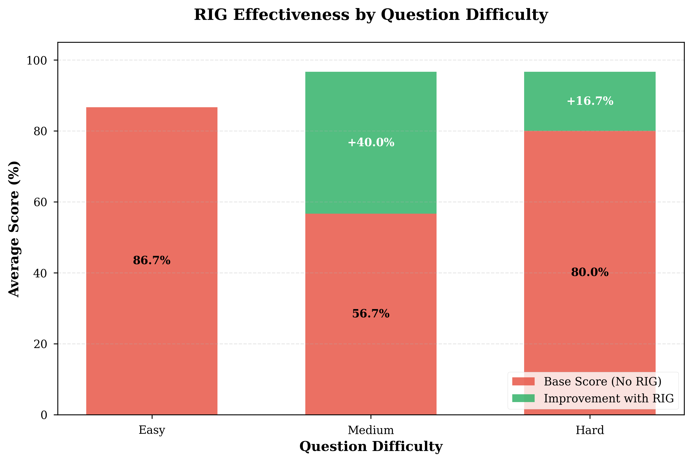

RIG effectiveness varies by question difficulty level:

- **Easy questions**: +0.0% average improvement
- **Medium questions**: +40.0% average improvement
- **Hard questions**: +16.7% average improvement

---

## 4. Efficiency Analysis

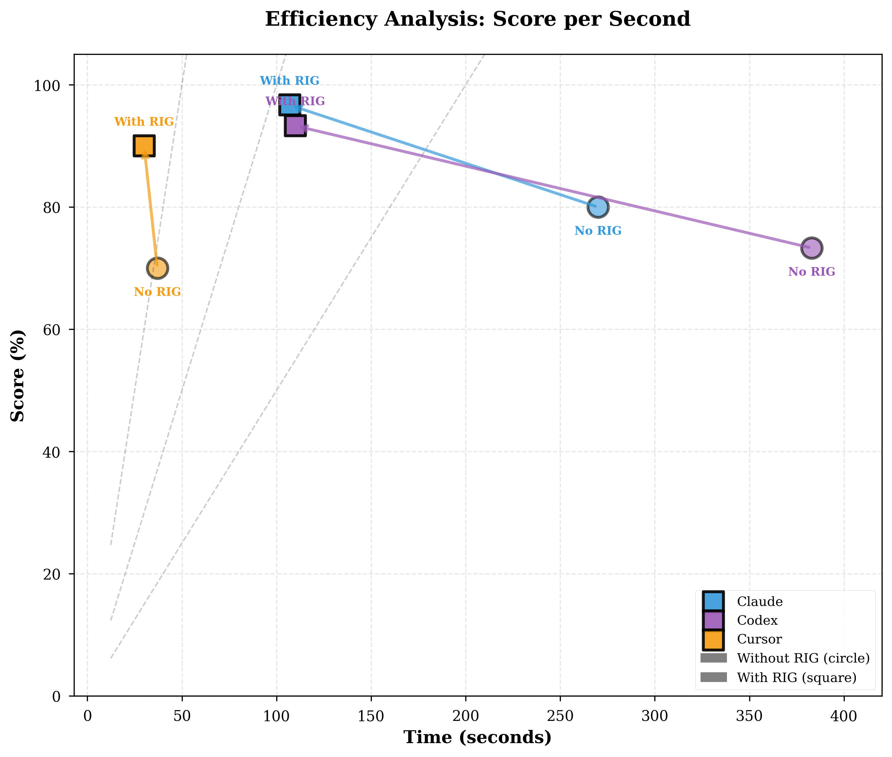

This scatter plot shows the relationship between time and accuracy for each agent. 
Arrows indicate the direction of change when RIG is introduced. 
The ideal trajectory is toward the upper-left (higher score, less time).

**Interpretation**:
- **Claude**: improved both speed and accuracy
- **Codex**: improved both speed and accuracy
- **Cursor**: improved both speed and accuracy

---

## 5. Question-Level Analysis

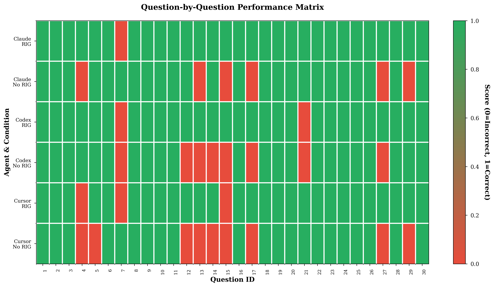

This heatmap visualizes per-question performance for each agent and condition. 
Green indicates correct answers, red indicates incorrect answers. 
Patterns reveal which questions benefit most from RIG.

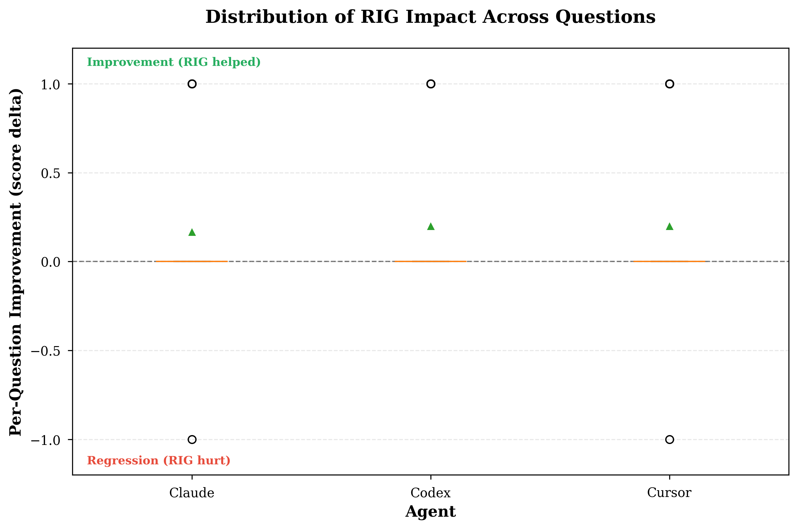

The box plot shows the distribution of RIG's impact across questions. 
Positive values indicate questions where RIG helped, negative values indicate regressions.

---

## 6. Category Performance

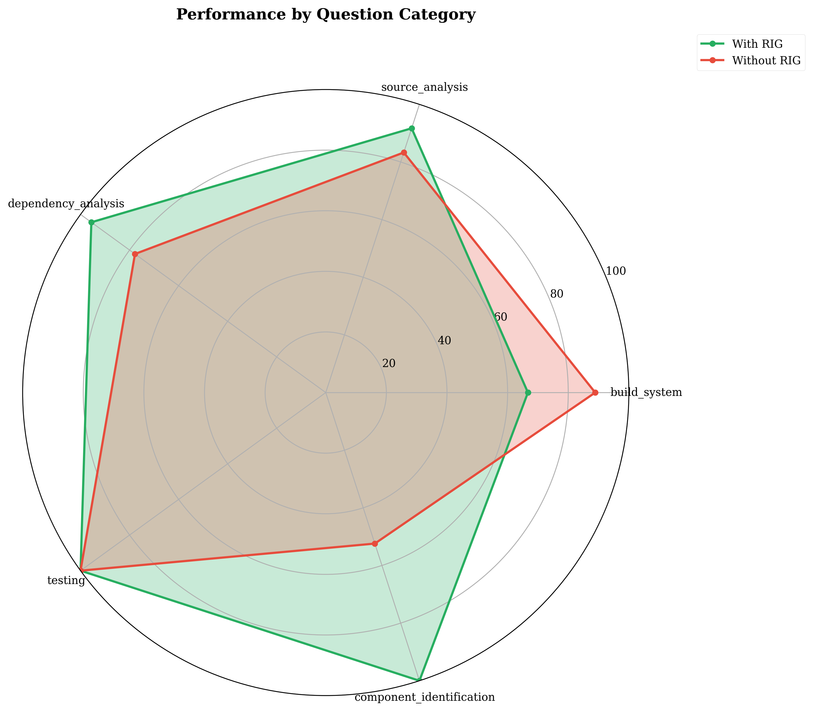

Performance breakdown by question category shows where RIG provides the most benefit:

- **build_system**: 88.9% → 66.7% (+-22.2%)
- **source_analysis**: 83.3% → 91.7% (+8.4%)
- **dependency_analysis**: 77.8% → 95.6% (+17.8%)
- **testing**: 100.0% → 100.0% (+0.0%)
- **component_identification**: 52.4% → 100.0% (+47.6%)

---

## 7. Detailed Impact: Questions Fixed vs Broken


An honest assessment of RIG's impact, showing both improvements and regressions:

### Questions Fixed by RIG

- **Claude**: 6 questions (4, 13, 15, 17, 27, 29)
- **Codex**: 6 questions (12, 13, 14, 15, 17, 27)
- **Cursor**: 7 questions (5, 12, 13, 14, 17, 27, 29)

### Questions Broken by RIG

- **Claude**: 1 questions (7)
- **Codex**: None
- **Cursor**: 1 questions (7)

### Net Impact

- **Claude**: +5 questions (net improvement)
- **Codex**: +6 questions (net improvement)
- **Cursor**: +6 questions (net improvement)

---

## Conclusions

RIG demonstrates measurable value for the **microservices** repository:

1. **Significant accuracy improvement**: +18.9 percentage points average
2. **Substantial time savings**: 64.2% average reduction
3. **Most benefit**: Codex saw 20.0% improvement

**Recommendation**: RIG provides measurable value for microservices and should be adopted.

---

*This report was automatically generated by results_visualizer.py*


---

## <a id="maven"></a>maven: Detailed Analysis

# RIG Effectiveness Analysis: maven

**Repository**: `maven`
**Agents Tested**: Claude, Codex, Cursor
**Total Questions**: 30
**Generated**: 2025-11-20 13:34 UTC

---

## Executive Summary

This analysis evaluates the effectiveness of RIG (Repository Information Generation) on agent performance for the **maven** repository. 
Three agents (Claude, Codex, Cursor) answered 30 questions both with and without access to RIG metadata.

**Key Finding**: RIG improved average agent performance by **5.5 percentage points** 
(91.1% → 96.7%) while reducing average completion time by **35.4%** 
(104.7s → 67.7s).

---

## 1. Overall Performance

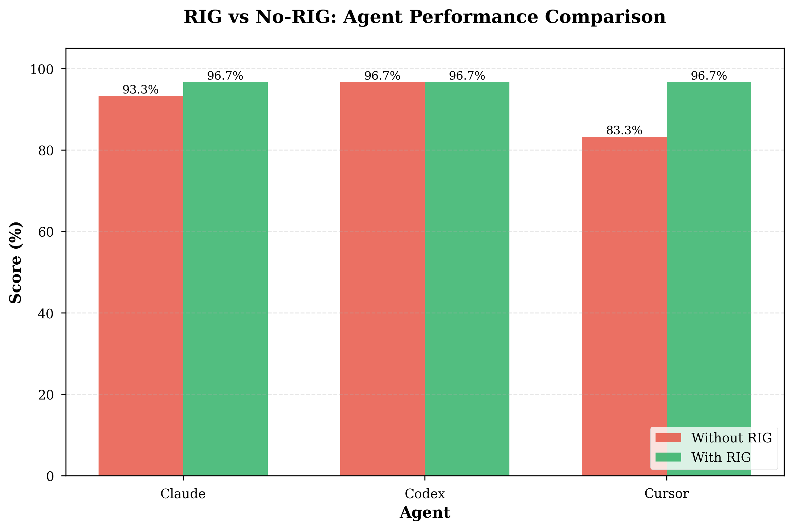

**Key Findings**:
- Average score with RIG: **96.7%**
- Average score without RIG: **91.1%**
- **Improvement: +5.5 percentage points**

### Per-Agent Performance

| Agent | Without RIG | With RIG | Improvement |
|-------|-------------|----------|-------------|
| Claude | 93.3% | 96.7% | +3.3% |
| Codex | 96.7% | 96.7% | +0.0% |
| Cursor | 83.3% | 96.7% | +13.3% |

---

## 2. Time Performance

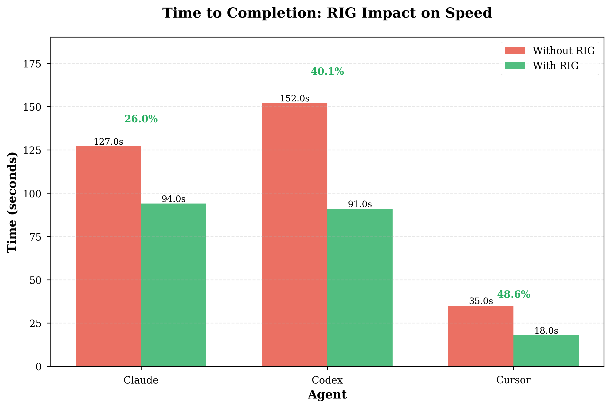

**Key Findings**:
- Average time with RIG: **67.7 seconds**
- Average time without RIG: **104.7 seconds**
- **Time saved: 111.0 seconds (35.4% reduction)**

### Per-Agent Time Performance

| Agent | Without RIG | With RIG | Time Saved | Reduction |
|-------|-------------|----------|------------|-----------|
| Claude | 127.0s | 94.0s | 33.0s | 26.0% |
| Codex | 152.0s | 91.0s | 61.0s | 40.1% |
| Cursor | 35.0s | 18.0s | 17.0s | 48.6% |

---

## 3. Difficulty Analysis

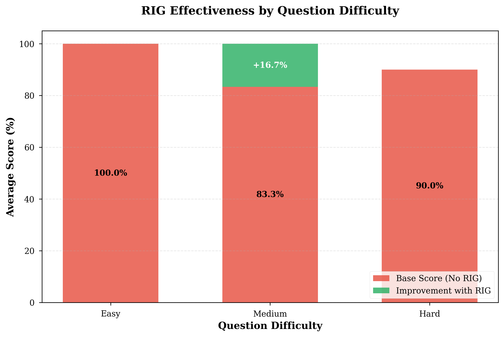

RIG effectiveness varies by question difficulty level:

- **Easy questions**: +0.0% average improvement
- **Medium questions**: +16.7% average improvement
- **Hard questions**: +0.0% average improvement

---

## 4. Efficiency Analysis

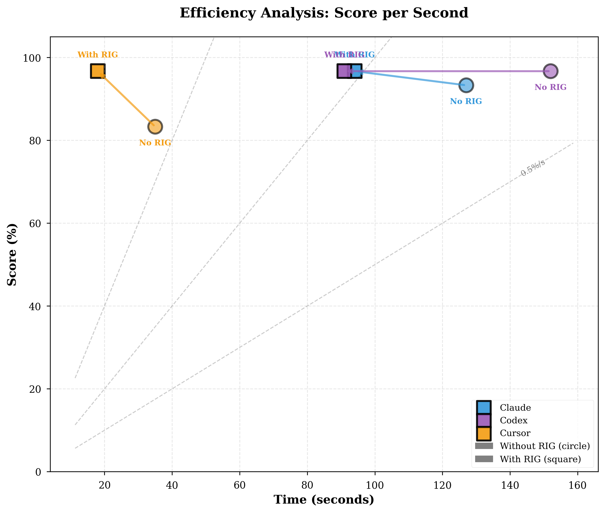

This scatter plot shows the relationship between time and accuracy for each agent. 
Arrows indicate the direction of change when RIG is introduced. 
The ideal trajectory is toward the upper-left (higher score, less time).

**Interpretation**:
- **Claude**: improved both speed and accuracy
- **Codex**: became both slower and less accurate
- **Cursor**: improved both speed and accuracy

---

## 5. Question-Level Analysis

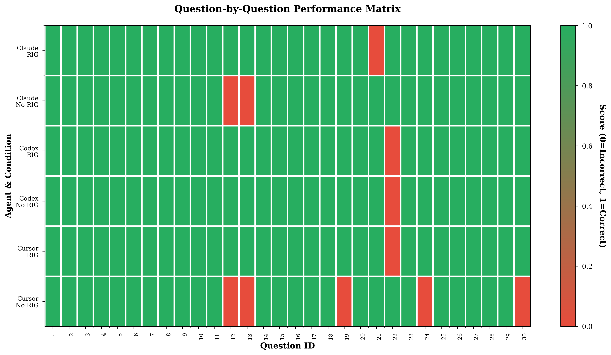

This heatmap visualizes per-question performance for each agent and condition. 
Green indicates correct answers, red indicates incorrect answers. 
Patterns reveal which questions benefit most from RIG.

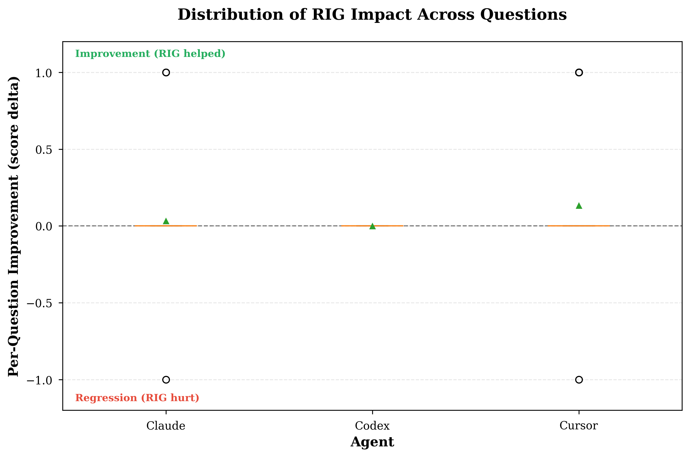

The box plot shows the distribution of RIG's impact across questions. 
Positive values indicate questions where RIG helped, negative values indicate regressions.

---

## 6. Category Performance

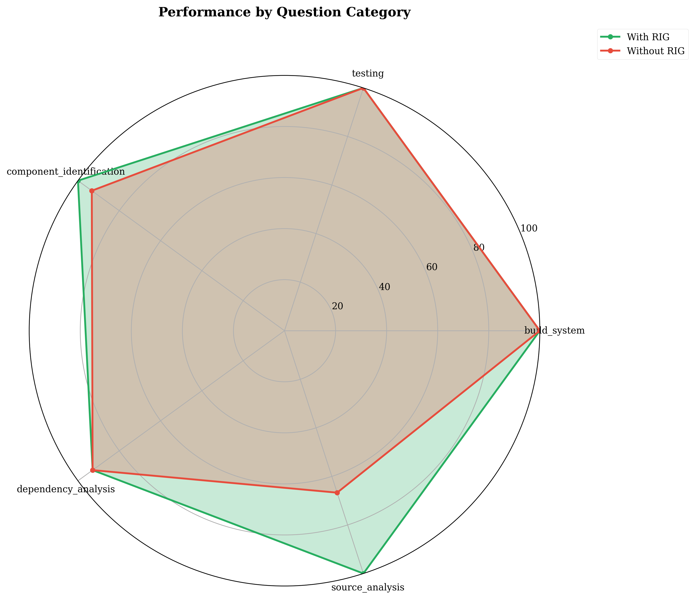

Performance breakdown by question category shows where RIG provides the most benefit:

- **build_system**: 100.0% → 100.0% (+0.0%)
- **testing**: 100.0% → 100.0% (+0.0%)
- **component_identification**: 93.3% → 100.0% (+6.7%)
- **dependency_analysis**: 92.9% → 92.9% (+0.0%)
- **source_analysis**: 66.7% → 100.0% (+33.3%)

---

## 7. Detailed Impact: Questions Fixed vs Broken

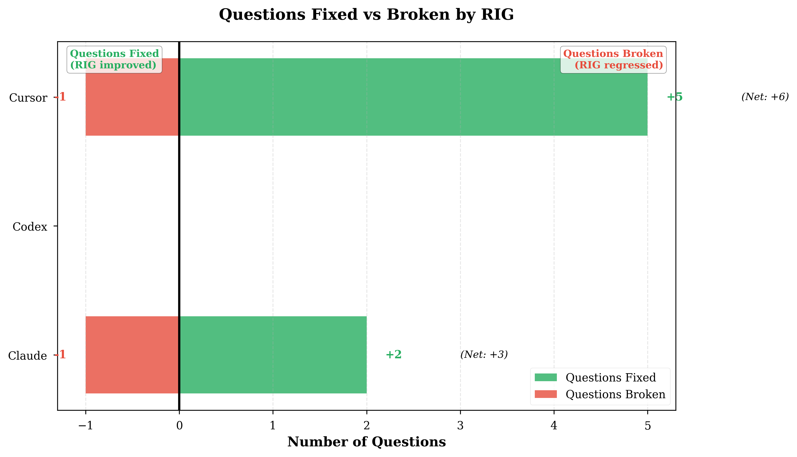

An honest assessment of RIG's impact, showing both improvements and regressions:

### Questions Fixed by RIG

- **Claude**: 2 questions (12, 13)
- **Codex**: None
- **Cursor**: 5 questions (12, 13, 19, 24, 30)

### Questions Broken by RIG

- **Claude**: 1 questions (21)
- **Codex**: None
- **Cursor**: 1 questions (22)

### Net Impact

- **Claude**: +1 questions (net improvement)
- **Codex**: 0 questions (net improvement)
- **Cursor**: +4 questions (net improvement)

---

## Conclusions

RIG demonstrates measurable value for the **maven** repository:

1. **Significant accuracy improvement**: +5.5 percentage points average
2. **Substantial time savings**: 35.4% average reduction
3. **Most benefit**: Cursor saw 13.3% improvement

**Recommendation**: RIG provides measurable value for maven and should be adopted.

---

*This report was automatically generated by results_visualizer.py*


---

## <a id="meson"></a>meson: Detailed Analysis

# RIG Effectiveness Analysis: embedded_system

**Repository**: `embedded_system`
**Agents Tested**: Claude, Codex, Cursor
**Total Questions**: 30
**Generated**: 2025-11-20 13:34 UTC

---

## Executive Summary

This analysis evaluates the effectiveness of RIG (Repository Information Generation) on agent performance for the **embedded_system** repository. 
Three agents (Claude, Codex, Cursor) answered 30 questions both with and without access to RIG metadata.

**Key Finding**: RIG improved average agent performance by **8.9 percentage points** 
(85.6% → 94.4%) while reducing average completion time by **56.9%** 
(170.3s → 73.3s).

---

## 1. Overall Performance

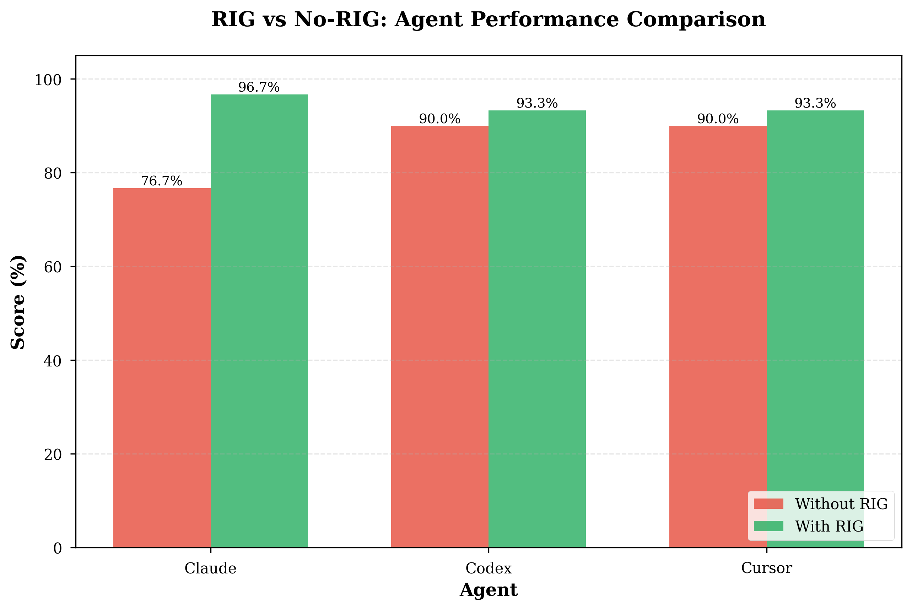

**Key Findings**:
- Average score with RIG: **94.4%**
- Average score without RIG: **85.6%**
- **Improvement: +8.9 percentage points**

### Per-Agent Performance

| Agent | Without RIG | With RIG | Improvement |
|-------|-------------|----------|-------------|
| Claude | 76.7% | 96.7% | +20.0% |
| Codex | 90.0% | 93.3% | +3.3% |
| Cursor | 90.0% | 93.3% | +3.3% |

---

## 2. Time Performance

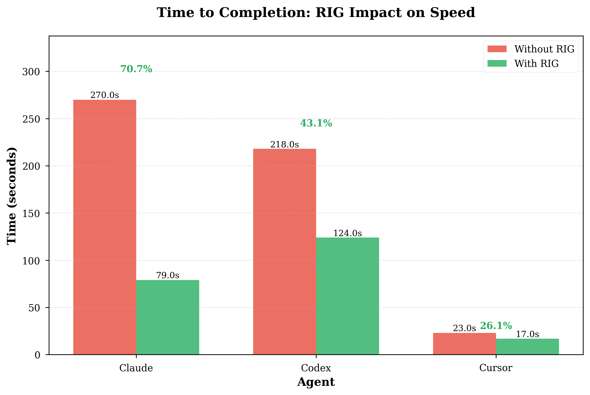

**Key Findings**:
- Average time with RIG: **73.3 seconds**
- Average time without RIG: **170.3 seconds**
- **Time saved: 291.0 seconds (56.9% reduction)**

### Per-Agent Time Performance

| Agent | Without RIG | With RIG | Time Saved | Reduction |
|-------|-------------|----------|------------|-----------|
| Claude | 270.0s | 79.0s | 191.0s | 70.7% |
| Codex | 218.0s | 124.0s | 94.0s | 43.1% |
| Cursor | 23.0s | 17.0s | 6.0s | 26.1% |

---

## 3. Difficulty Analysis

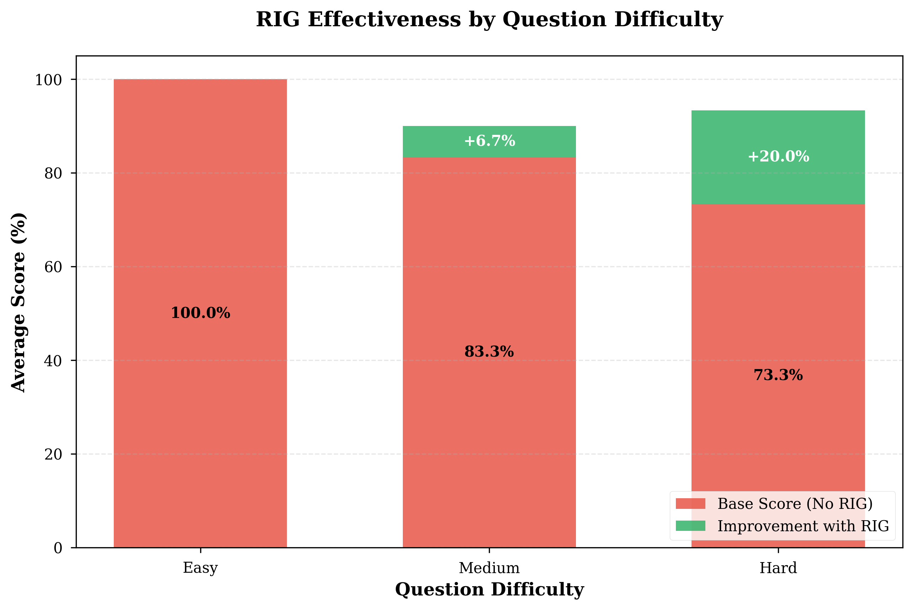

RIG effectiveness varies by question difficulty level:

- **Easy questions**: +0.0% average improvement
- **Medium questions**: +6.7% average improvement
- **Hard questions**: +20.0% average improvement

---

## 4. Efficiency Analysis


This scatter plot shows the relationship between time and accuracy for each agent. 
Arrows indicate the direction of change when RIG is introduced. 
The ideal trajectory is toward the upper-left (higher score, less time).

**Interpretation**:
- **Claude**: improved both speed and accuracy
- **Codex**: improved both speed and accuracy
- **Cursor**: improved both speed and accuracy

---

## 5. Question-Level Analysis


This heatmap visualizes per-question performance for each agent and condition. 
Green indicates correct answers, red indicates incorrect answers. 
Patterns reveal which questions benefit most from RIG.

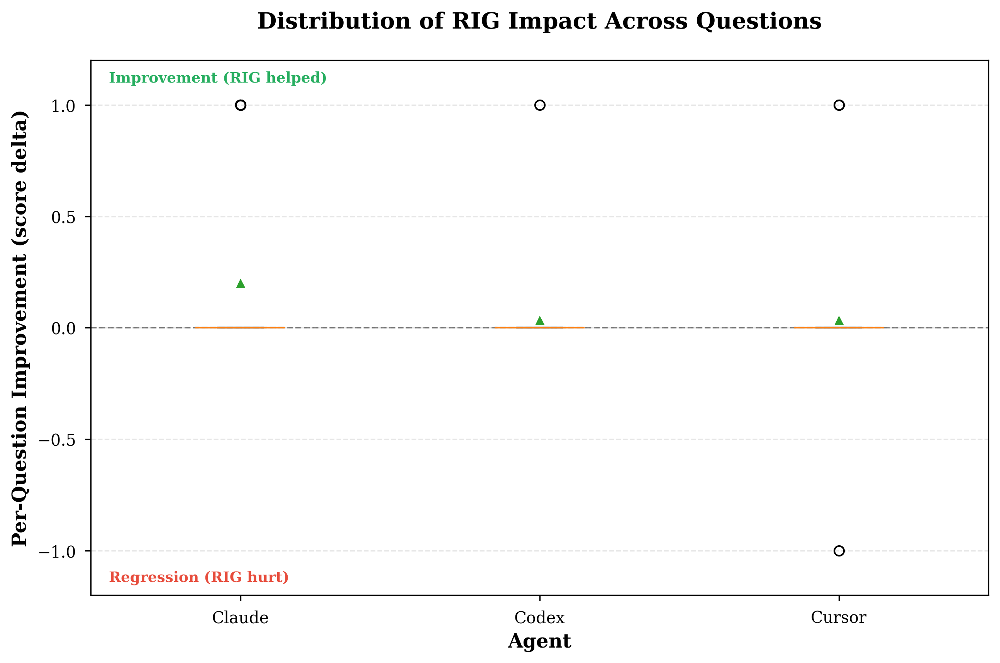

The box plot shows the distribution of RIG's impact across questions. 
Positive values indicate questions where RIG helped, negative values indicate regressions.

---

## 6. Category Performance

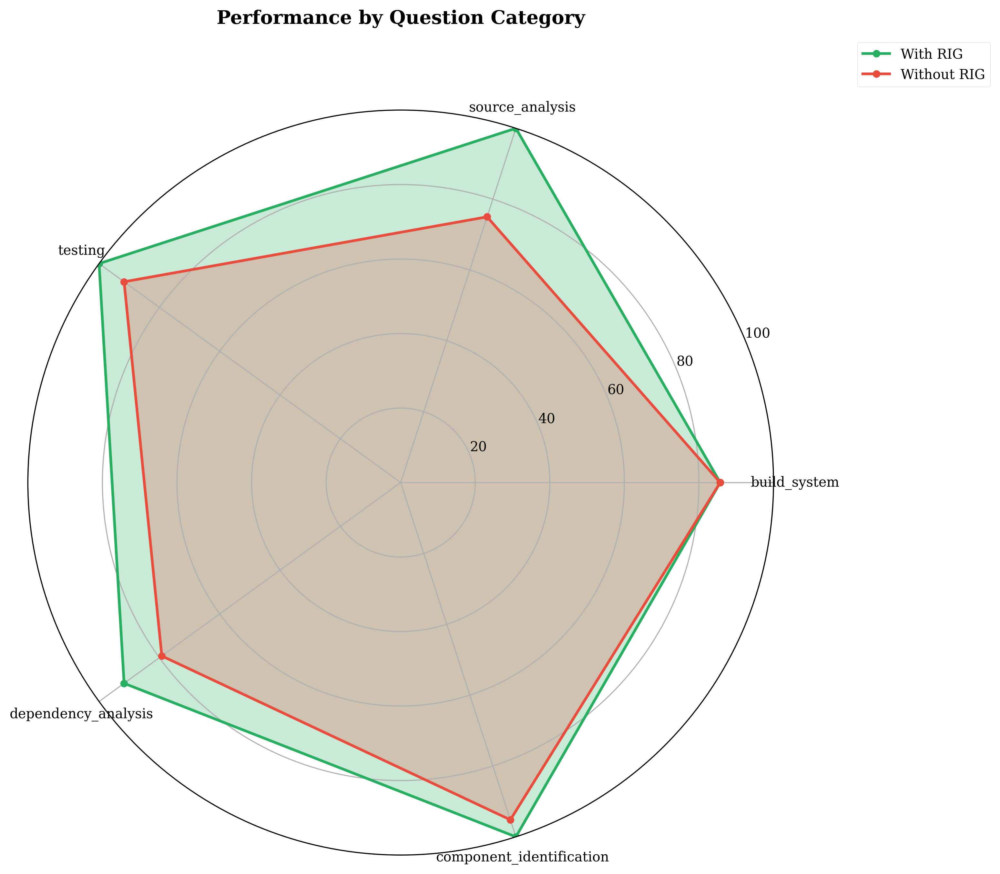

Performance breakdown by question category shows where RIG provides the most benefit:

- **build_system**: 85.7% → 85.7% (+0.0%)
- **source_analysis**: 75.0% → 100.0% (+25.0%)
- **testing**: 91.7% → 100.0% (+8.3%)
- **dependency_analysis**: 79.2% → 91.7% (+12.5%)
- **component_identification**: 95.2% → 100.0% (+4.8%)

---

## 7. Detailed Impact: Questions Fixed vs Broken

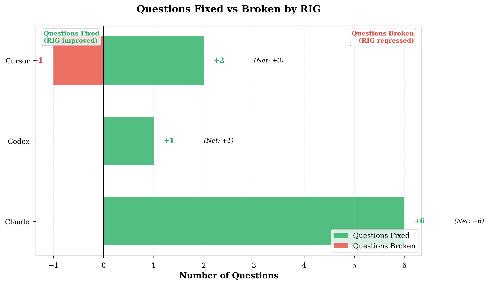

An honest assessment of RIG's impact, showing both improvements and regressions:

### Questions Fixed by RIG

- **Claude**: 6 questions (20, 22, 24, 25, 29, 30)
- **Codex**: 1 questions (30)
- **Cursor**: 2 questions (11, 30)

### Questions Broken by RIG

- **Claude**: None
- **Codex**: None
- **Cursor**: 1 questions (24)

### Net Impact

- **Claude**: +6 questions (net improvement)
- **Codex**: +1 questions (net improvement)
- **Cursor**: +1 questions (net improvement)

---

## Conclusions

RIG demonstrates measurable value for the **embedded_system** repository:

1. **Significant accuracy improvement**: +8.9 percentage points average
2. **Substantial time savings**: 56.9% average reduction
3. **Most benefit**: Claude saw 20.0% improvement

**Recommendation**: RIG provides measurable value for embedded_system and should be adopted.

---

*This report was automatically generated by results_visualizer.py*


---

## <a id="npm"></a>npm: Detailed Analysis

# RIG Effectiveness Analysis: npm

**Repository**: `npm`
**Agents Tested**: Claude, Codex, Cursor
**Total Questions**: 30
**Generated**: 2025-11-20 13:34 UTC

---

## Executive Summary

This analysis evaluates the effectiveness of RIG (Repository Information Generation) on agent performance for the **npm** repository. 
Three agents (Claude, Codex, Cursor) answered 30 questions both with and without access to RIG metadata.

**Key Finding**: RIG improved average agent performance by **27.8 percentage points** 
(50.0% → 77.8%) while reducing average completion time by **74.1%** 
(440.0s → 114.0s).

---

## 1. Overall Performance

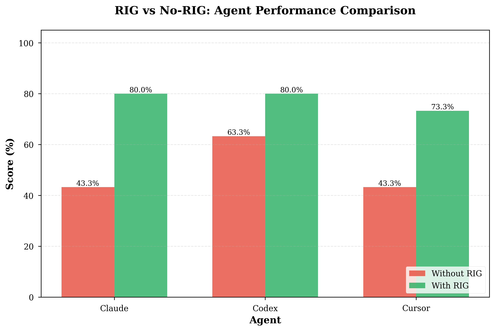

**Key Findings**:
- Average score with RIG: **77.8%**
- Average score without RIG: **50.0%**
- **Improvement: +27.8 percentage points**

### Per-Agent Performance

| Agent | Without RIG | With RIG | Improvement |
|-------|-------------|----------|-------------|
| Claude | 43.3% | 80.0% | +36.7% |
| Codex | 63.3% | 80.0% | +16.7% |
| Cursor | 43.3% | 73.3% | +30.0% |

---

## 2. Time Performance


**Key Findings**:
- Average time with RIG: **114.0 seconds**
- Average time without RIG: **440.0 seconds**
- **Time saved: 978.0 seconds (74.1% reduction)**

### Per-Agent Time Performance

| Agent | Without RIG | With RIG | Time Saved | Reduction |
|-------|-------------|----------|------------|-----------|
| Claude | 246.0s | 111.0s | 135.0s | 54.9% |
| Codex | 1027.0s | 190.0s | 837.0s | 81.5% |
| Cursor | 47.0s | 41.0s | 6.0s | 12.8% |

---

## 3. Difficulty Analysis

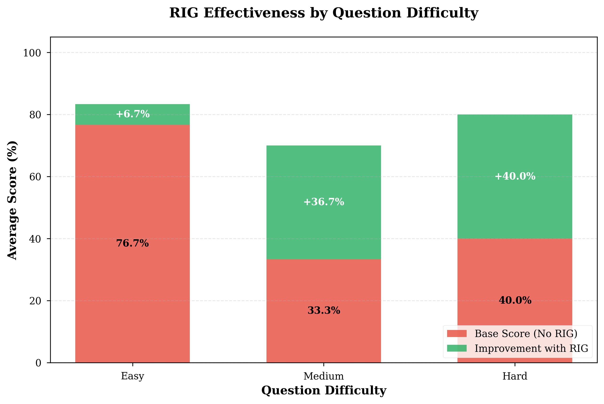

RIG effectiveness varies by question difficulty level:

- **Easy questions**: +6.7% average improvement
- **Medium questions**: +36.7% average improvement
- **Hard questions**: +40.0% average improvement

---

## 4. Efficiency Analysis

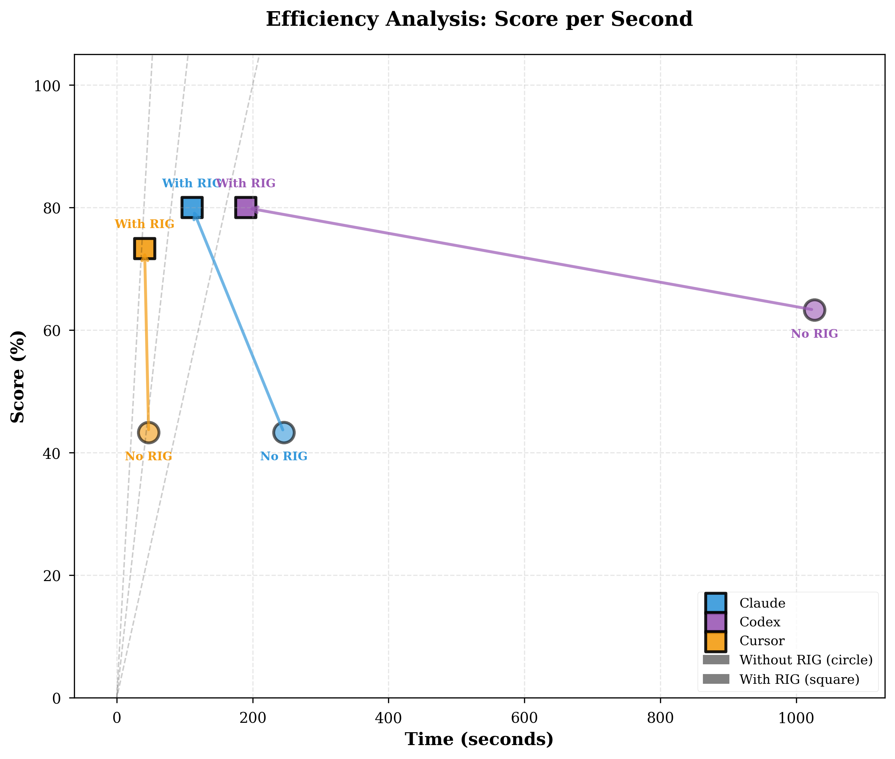

This scatter plot shows the relationship between time and accuracy for each agent. 
Arrows indicate the direction of change when RIG is introduced. 
The ideal trajectory is toward the upper-left (higher score, less time).

**Interpretation**:
- **Claude**: improved both speed and accuracy
- **Codex**: improved both speed and accuracy
- **Cursor**: improved both speed and accuracy

---

## 5. Question-Level Analysis

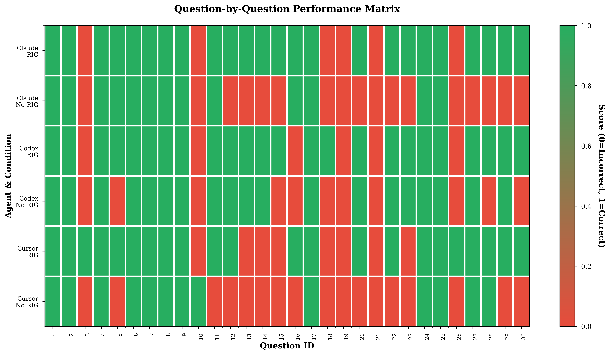

This heatmap visualizes per-question performance for each agent and condition. 
Green indicates correct answers, red indicates incorrect answers. 
Patterns reveal which questions benefit most from RIG.

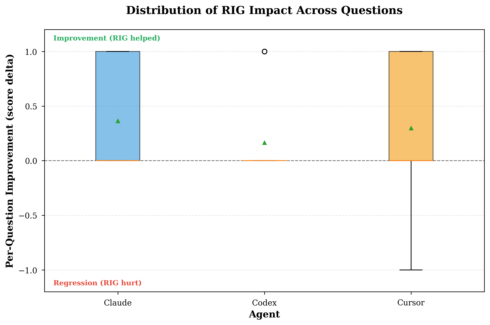

The box plot shows the distribution of RIG's impact across questions. 
Positive values indicate questions where RIG helped, negative values indicate regressions.

---

## 6. Category Performance

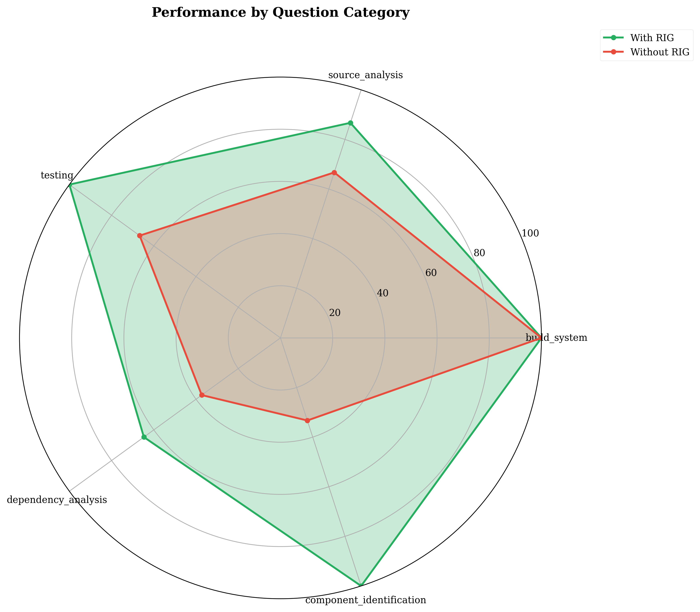

Performance breakdown by question category shows where RIG provides the most benefit:

- **build_system**: 100.0% → 100.0% (+0.0%)
- **source_analysis**: 66.7% → 86.7% (+20.0%)
- **testing**: 66.7% → 100.0% (+33.3%)
- **dependency_analysis**: 37.3% → 64.7% (+27.4%)
- **component_identification**: 33.3% → 100.0% (+66.7%)

---

## 7. Detailed Impact: Questions Fixed vs Broken

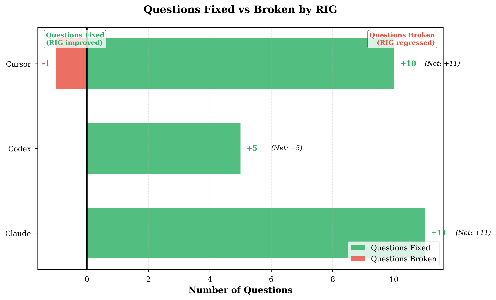

An honest assessment of RIG's impact, showing both improvements and regressions:

### Questions Fixed by RIG

- **Claude**: 11 questions (12, 13, 14, 15, 20, 22, 23, 27, 28, 29, 30)
- **Codex**: 5 questions (5, 15, 18, 28, 30)
- **Cursor**: 10 questions (3, 5, 11, 12, 16, 20, 22, 26, 29, 30)

### Questions Broken by RIG

- **Claude**: None
- **Codex**: None
- **Cursor**: 1 questions (10)

### Net Impact

- **Claude**: +11 questions (net improvement)
- **Codex**: +5 questions (net improvement)
- **Cursor**: +9 questions (net improvement)

---

## Conclusions

RIG demonstrates measurable value for the **npm** repository:

1. **Significant accuracy improvement**: +27.8 percentage points average
2. **Substantial time savings**: 74.1% average reduction
3. **Most benefit**: Claude saw 36.7% improvement

**Recommendation**: RIG provides measurable value for npm and should be adopted.

---

*This report was automatically generated by results_visualizer.py*


---

## <a id="cargo"></a>cargo: Detailed Analysis

# RIG Effectiveness Analysis: rholang

**Repository**: `rholang`
**Agents Tested**: Claude, Codex, Cursor
**Total Questions**: 30
**Generated**: 2025-11-20 13:34 UTC

---

## Executive Summary

This analysis evaluates the effectiveness of RIG (Repository Information Generation) on agent performance for the **rholang** repository. 
Three agents (Claude, Codex, Cursor) answered 30 questions both with and without access to RIG metadata.

**Key Finding**: RIG improved average agent performance by **10.0 percentage points** 
(87.8% → 97.8%) while reducing average completion time by **60.2%** 
(251.3s → 100.0s).

---

## 1. Overall Performance

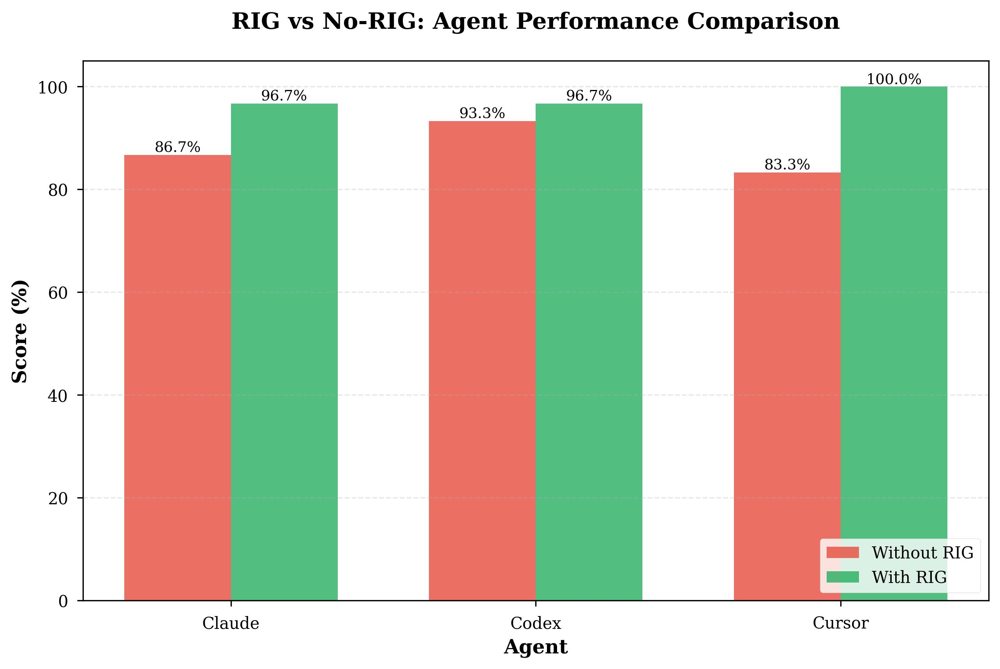

**Key Findings**:
- Average score with RIG: **97.8%**
- Average score without RIG: **87.8%**
- **Improvement: +10.0 percentage points**

### Per-Agent Performance

| Agent | Without RIG | With RIG | Improvement |
|-------|-------------|----------|-------------|
| Claude | 86.7% | 96.7% | +10.0% |
| Codex | 93.3% | 96.7% | +3.3% |
| Cursor | 83.3% | 100.0% | +16.7% |

---

## 2. Time Performance

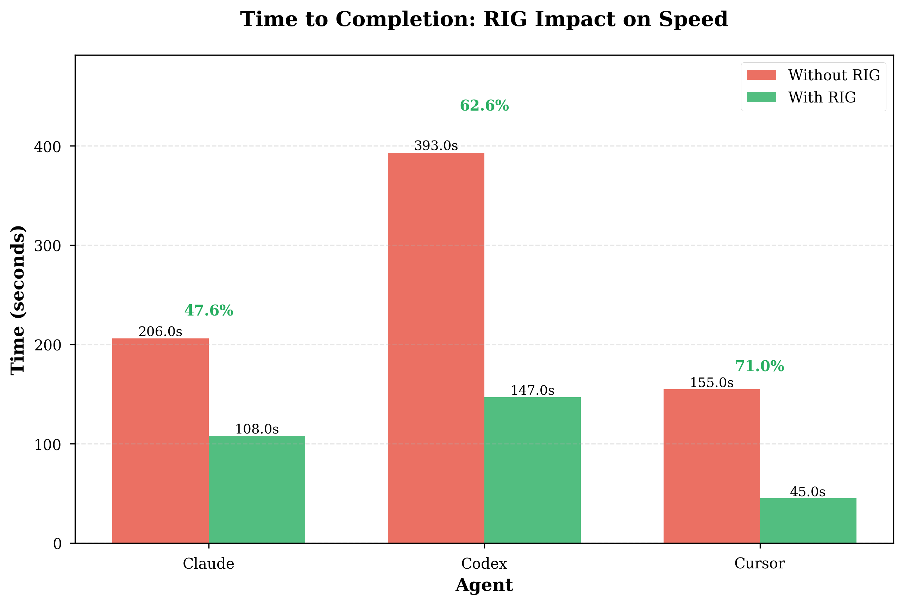

**Key Findings**:
- Average time with RIG: **100.0 seconds**
- Average time without RIG: **251.3 seconds**
- **Time saved: 454.0 seconds (60.2% reduction)**

### Per-Agent Time Performance

| Agent | Without RIG | With RIG | Time Saved | Reduction |
|-------|-------------|----------|------------|-----------|
| Claude | 206.0s | 108.0s | 98.0s | 47.6% |
| Codex | 393.0s | 147.0s | 246.0s | 62.6% |
| Cursor | 155.0s | 45.0s | 110.0s | 71.0% |

---

## 3. Difficulty Analysis

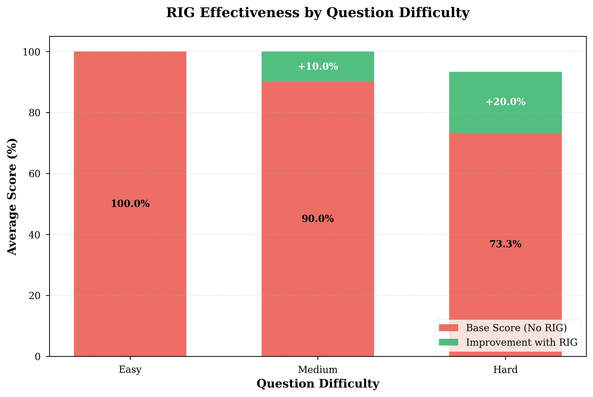

RIG effectiveness varies by question difficulty level:

- **Easy questions**: +0.0% average improvement
- **Medium questions**: +10.0% average improvement
- **Hard questions**: +20.0% average improvement

---

## 4. Efficiency Analysis

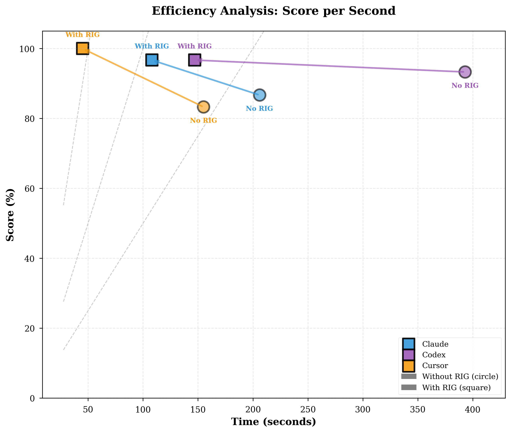

This scatter plot shows the relationship between time and accuracy for each agent. 
Arrows indicate the direction of change when RIG is introduced. 
The ideal trajectory is toward the upper-left (higher score, less time).

**Interpretation**:
- **Claude**: improved both speed and accuracy
- **Codex**: improved both speed and accuracy
- **Cursor**: improved both speed and accuracy

---

## 5. Question-Level Analysis

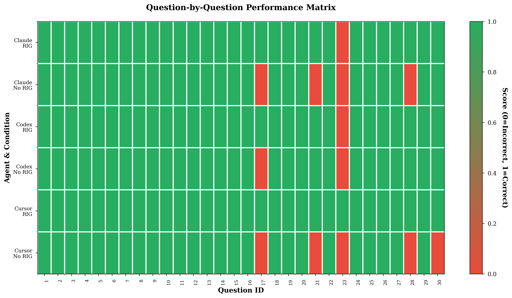

This heatmap visualizes per-question performance for each agent and condition. 
Green indicates correct answers, red indicates incorrect answers. 
Patterns reveal which questions benefit most from RIG.

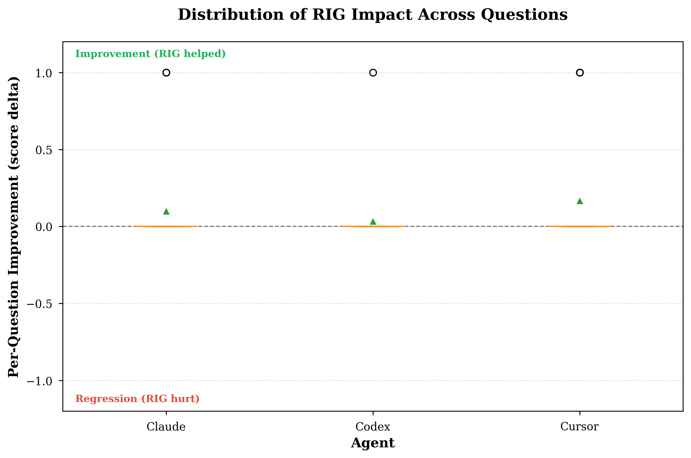

The box plot shows the distribution of RIG's impact across questions. 
Positive values indicate questions where RIG helped, negative values indicate regressions.

---

## 6. Category Performance

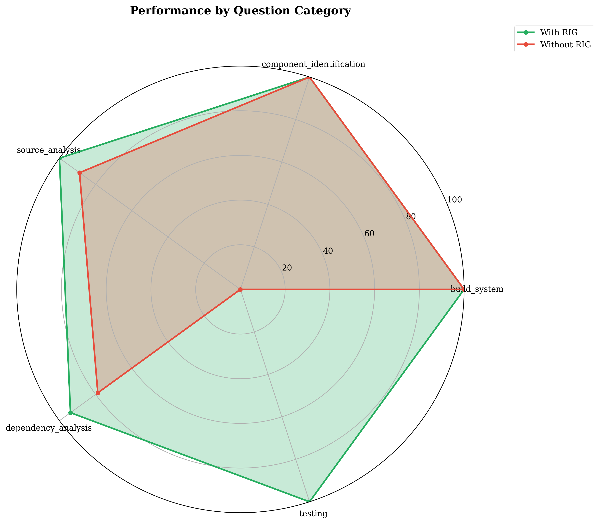

Performance breakdown by question category shows where RIG provides the most benefit:

- **build_system**: 100.0% → 100.0% (+0.0%)
- **component_identification**: 100.0% → 100.0% (+0.0%)
- **source_analysis**: 88.9% → 100.0% (+11.1%)
- **dependency_analysis**: 78.8% → 93.9% (+15.1%)
- **testing**: 0.0% → 100.0% (+100.0%)

---

## 7. Detailed Impact: Questions Fixed vs Broken

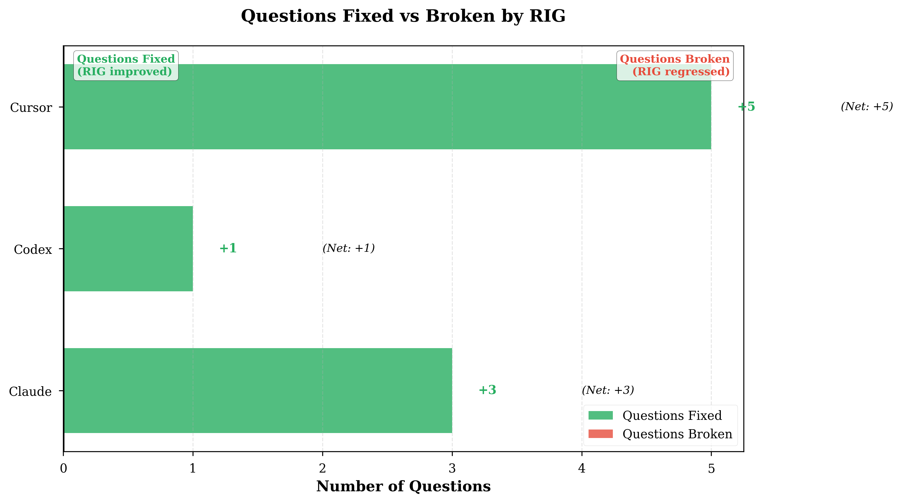

An honest assessment of RIG's impact, showing both improvements and regressions:

### Questions Fixed by RIG

- **Claude**: 3 questions (17, 21, 28)
- **Codex**: 1 questions (17)
- **Cursor**: 5 questions (17, 21, 23, 28, 30)

### Questions Broken by RIG

- **Claude**: None
- **Codex**: None
- **Cursor**: None

### Net Impact

- **Claude**: +3 questions (net improvement)
- **Codex**: +1 questions (net improvement)
- **Cursor**: +5 questions (net improvement)

---

## Conclusions

RIG demonstrates measurable value for the **rholang** repository:

1. **Significant accuracy improvement**: +10.0 percentage points average
2. **Substantial time savings**: 60.2% average reduction
3. **Most benefit**: Cursor saw 16.7% improvement

**Recommendation**: RIG provides measurable value for rholang and should be adopted.

---

*This report was automatically generated by results_visualizer.py*


---

---

*This report was automatically generated on 2025-11-20 13:34 UTC*